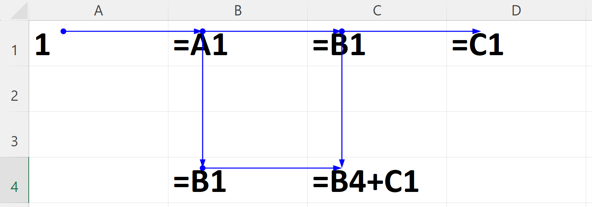

*******************
Formula calculation
*******************

Each cell in a sheet contains a value. For most cells, the value is
``Blank.Value``. Sheet can also contain formulas that determine values of
other cells during recalculation.

Formula can modify one of more cells, normal formula are only for one cell,
array or data table formula can change many cells.

Please do read the `Excel Recalculation <https://learn.microsoft.com/en-us/office/client-developer/excel/excel-recalculation>`_
artible by Microsoft that describes the fundamentals.

Cell values
===========

``IXLCell`` provides two properties that give access to value of a cell:
``IXLCell.Value`` and ``IXLCell.CachedValue``.

There is an important difference between them:

* ``IXLCell.Value`` will check if cell contains a dirty formula and if it
  does, **the cell value is recalculated** before the value is returned.
  The getter always returns up-to-date value.
* ``IXLCell.CachedValue`` returns a value of a cell, even if the value is
  stale.

Using the ``IXLCell.Value`` thus carries a performance impact and if possible, the
``IXLCell.CachedValue`` should be used instead.

In order to acheve a performant code while working with formulas

* Use ``IXLCell.InsertData`` to insert data. It marks all formulas dependent
  on the inserted cells as dirty.
* Use ``IXLCell.Value`` setter for setting a single cell value. Setting a
  single value also triggers dirty marking (among other things), but only
  for the single cell. It is better to use ``IXLCell.InsertData`` for larger
  amount of data.
* Use ``IXLCell.CachedValue`` getter to retrieve a value of a cell.
* Use ``SaveOptions.EvaluateFormulasBeforeSaving`` to recalculate dirty
  formulas before saving the data to a file.
* Use ``IXLWorkbook.RecalculateAllFormulas()`` or
  ``IXLWorksheet.RecalculateAllFormulas()`` to update formulas. Note that this
  recalculates all formulas, not just non-dirty ones.

Dirty tracking
==============

Each formula can be dirty or non-dirty. Formula is dirty, if the value is
calculated last time might no longer be accurate. That can happen for several
reasons:

* Another cell the formula depends on changed value (e.g. ``=A1+2`` and ``A1``
  changed value from ``1`` to ``2``).
* Worksheet has been added or removed and thus some values might be available
  or are no longer available (e.g. ``=Test!A1``, but sheet ``Test`` didn't
  exist previously and was just added).
* Defined name was added or removed

Whether a formula is dirty can be checked through ``IXLCell.NeedsRecalculation``
property. Cells without formulas are never dirty.

Use ``IXLCell.InvalidateFormula()`` to mark the formula as dirty.

Transitive nature
-----------------

ClosedXML holds information about what areas formula depends on in a
`r-tree <https://en.wikipedia.org/wiki/R-tree>`_ (e.g. ``=SUM(A1:D4) + C7``
depends on ``A1:D4`` and ``C7:C7``). When an area of a sheet changes (e.g.
``B2`` is now ``7`` instead of ``5``), the r-tree finds all overlapping
areas that formulas depends on (e.g. ``A1:D4`` intersects with ``B2``) and
marks all those formulas as dirty.

This process continues, because cell of the formula is now also dirty and that
can affect other formulas.

Loaded formulas
---------------

When a formula is loaded and the cell also contains a value, the formula is not
marked as dirty on load. That is done under assumption that file contains the
truth about what value of a cell should be.

If a cell contains a formula, but not a value, the formula is marked as a dirty
during load.

Calculation chain
=================

Calculation chain contains all formula cells. The cells in the chain are in
the order in which they were evalualted during last formula calculation. Cell
should be in order of dependencies (e.g. if ``A2`` depends on ``A1``, ``A1``
should be positioned before the ``A2`` in the chain).

The "correct" order of the chain from the image might be any of following:

* B1, C1, D1, B4, C4
* B1, B4, C1, C4, D1
* B1, C1, B4, C4, D1
* B1, C1, B4, D1, C4 
* ...

The chain does't have to have correct order, it has the correct order during
last calculation (or any order, if no calculation was yet done). In the
beginning, the chain could look like this: D1, C1, B1, B4, C4.

When calc engine calculates formulas, it goes through the chain and tries to
evaluate each formula. If the formula depends on a cell that is dirty, it
stops evaluation of the current formula and moves the supporting formula before
the current one and start to evaluate the new current formula.

This way, chain should end up with a correct order.

.. note::
   The order of cells changes most during the first calculation and far less in
   subsequent calculations. That is the reason why first calculation is
   generally the slowest.

Cyclic dependencies
-------------------

Calc engine will throw an ``InvalidOperationException``, when it encounteres a
cycle in a calculation chain.
