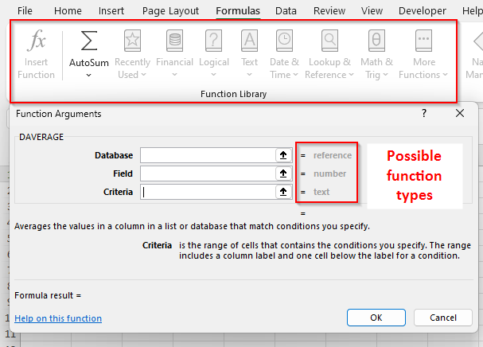
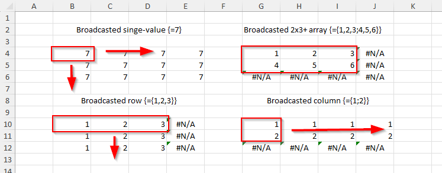
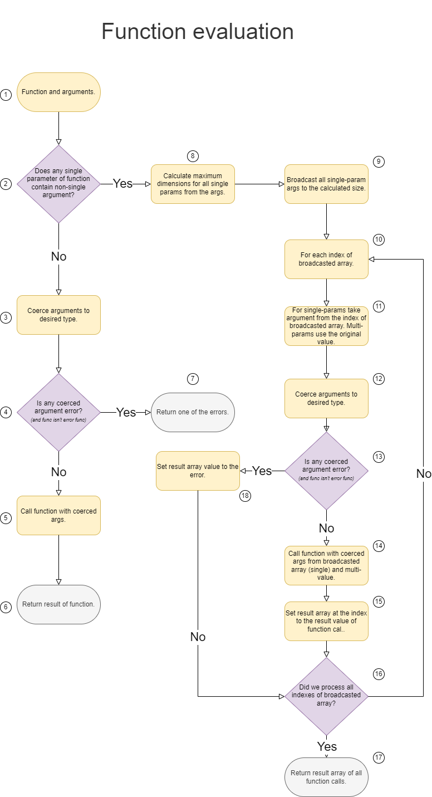
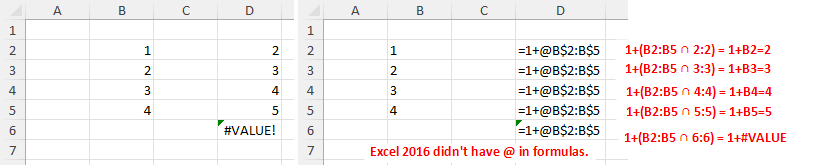

###################
Function evaluation
###################

Function call is at the center of formula evaluation. It is pretty straightforward for simple cases, but more complicated for other. This chapter will explain how function is evaluated.

There are generally four use cases for function evaluation:

* Executing one formula with scalar values and output is a scalar value, e.g. ``MOD(13,5)``.
* Executing one formula multiple times, e.g. ``SIN(A1:A3)`` will output array of 3 values (``{ SIN(A1); SIN(A2); SIN(A3) }``).
* Returning multiple values from a function, e.g. ``LINEST({2,4}, {1,2},TRUE,TRUE)`` will return 5x2 array of information about linear estimation of a function.
* Returning multiple values from a function as an intermediary value for another function, e.g. ``SUM(SIN(A1:A3))``.

******************
Function signature
******************

Each function has a name and a number of parameters. Each parameter of a function belongs to one of the following categories:

* single value parameter - the allowed value is one of ``blank``, ``logical``, ``number``, ``text``, ``error`` or ``single-cell`` reference. Single element array (e.g. ``{1}``) is **not** a single value.
* multi value parameter - any value, including reference unions or any allowed single value.

Example: Function ``LARGE(array, number)`` has two parameters, the first is multi-value, while second one is a single value.

This distinction is crucial for different behavior during evaluation and type coercion. Type coercion for single-value is relatively standardized across functions, while for type coercion for multi-value is generally function specific.

Function never returns a reference, unless it's a ref function (``CHOOSE``, ``IF``, ``IFS``, ``INDEX``, ``INDIRECT``, ``OFFSET``). All other functions return array or a scalar value.

Information about single/multi value is not specificed and has to be guessed and researched.

There are ways to determine if parameters is single or multi value:

Experiments
===========

Try to guess which parameter is single and which one is multi. Generally, trying evaluate function with a single array value (``TYPE(FUNC({1}, remaining_single_args))`` returns 64 (indicating array) while ``TYPE(FUNC(1, remaining_single_args))`` returns non-array.

.. note::
   - ``TYPE(MOD(5,3))`` returns 1 while ``TYPE(MOD({5},3))`` returns 64. It indicates that first parameter of ``MOD`` function is a single.
   - ``TYPE(ROWS(5))`` returns 1 and ``TYPE(ROWS({5}))`` also returns 1. It indicates that parameter is multi value.

Documentation
=============

There are several possible source of documentation:

* [ISO-29500]/[ECMA-376] chapter 18.17.7 contain information about all predefined functions up to Excel 2016. Also, the [MS-OI29500] often contains some extra info.
* MS documentation provides information about all functions at `Excel functions (alphabetical) <https://support.microsoft.com/en-us/office/excel-functions-alphabetical-b3944572-255d-4efb-bb96-c6d90033e188>`_
* Excel contain function library at formulas tab.

All the source are often incomplete or just plain wrong. Generally, Excel function library has most accurate info.

**********************
Argument type coercion
**********************

Each function parameter has expected type. The most generic function can accept value of any type, but most are more limited and only expect subtype.

Generally speaking, function parameter expects one of the following types:

* number
* text
* logical - true/false
* array - array of values.
* area reference - a rectangular range of cells in a sheet.
* reference - more generic reference, e.g. union of multiple areas or 3D reference.
* any - any type, including blanks. The function will take care of coercion by itself.

If provided argument value is not of expected type, calc engine attempts to coerce argument type to expected parameter type. If the value can't be converted, the result is an error ``#VALUE!``.

Single value parameters
=======================

Due to inherent properties of function evaluation, single value parameters will never receive array or non-single cell references. If reference is a *single-cell reference* (e.g. A7), the coercion will take value of the cell and uses other conversions on the value of the cell.

.. note::
   Dates and time span types are a polite fiction and they are processed as their serial date-time value.

Number parameter
----------------

Number type parameter will attempt to coerce arguments this way:

* *blank* - use value *0*.
* *logical* - convert to *0* or *1*.
* *number* - use the number value.
* *text* - if it is convertible through VALUE semantic (e.g. "10", "2 1/2" or "1900-01-10"), convert to number or serial date time. Incovertible texts (e.g. "ten", "") are coerced to ``#VALUE!`` error.

Some functions expect integer parameters. Conversion from number to integer is function specific, though in most cases the value is tuncated, though not always (e.g. ``LARGE`` uses ceiling).

Logical parameter
-----------------

Logical type parameter will attempt to coerce arguments this way:

* *blank* - use value *FALSE*.
* *logical* - use the value directly.
* *number* - value *0* is converted to *FALSE*, remaining numbers are converted to *TRUE*.
* *text* - values *TRUE* or *FALSE* (case insensitive) is converted. No extra spaces allowed. Other text are not valid and will be converted to ``#VALUE!``.

Text parameter
--------------

Text type parameter will attempt to coerce arguments this way:

* *blank* - convert to empty string.
* *logical* - convert to *TRUE* or *FALSE* text.
* *number* - converts to number using current culture (e.g. 12.3 is converted to "12,3"). This may cause unexpected behavior when workbook is opened in different cultures.
* *text* - use the value directly.

Multi-value parameters
======================

Multi-value params generally have function dependent behavior. There rarely is a type coercion of multi-valaue params, unlike scalar values (e.g. ``SUM("12", 1) = 12``, but ``SUM({"12"},1) = 1``).

Scalar values are generally converted to single element arrays and processed onwards.

If parameter accepts single-area reference, it can often always accept array without change in behavior, i.e. it doesn't matter whether value is passed as a ``{1,2;3,4}`` or as ``A1:B2`` (careful of blanks, references can contain have them, arrays can't). There are few outliers of this behavior (e.g. ``ISODD`` and ``ISEVEN``), but they are very rare.

Most functions can work with area reference (e.g. ``B7:G14``), but not generic reference (e.g. ``(B2:D10,C5:E45)``). Generic references includes union of disjoined areas, 3D references and so on.

**************
Error handling
**************

When function arguments contains an error, the result of function call is an error. It doesn't matter if error is in referenced cells, array values or just plain scalar value.

The only exception are functions dealing with errors: ``IFERROR``, ``ERROR.TYPE``, ``ISERROR``, ``ISERR``.

Thanks to this property, it doesn't really make sense to deal with error values in type coercion.

************
Broadcasting
************

Broadcasting is a process by which Excel rescales an array or array reference into different (larger)  size. Broadcasting is used when function has multiple array/area arguments of different size and it's necessary to rescale them to the same size (e.g. ``A1:B5 * {3,4,5}``). Broadcasting multi-area reference will result in ``#VALUE!``.

.. note::
   Array/reference inherently always are at least 1x1.

Broadcasting expands array/area the 
* Array/area is a single element - the broadcasted array repreats value in all its elements.
* Array/area is a row (1xN) - row is filled to the right with ``#N/A`` values and the row is cloned for every row of the broadcasted size.
* Array/area is a column (Nx1) - column is filled down with ``#N/A`` values and the column is cloned for every column of the broadcasted size.
* Arrays/area with size >= 2x2 - array is copied to the broadcasted array at top-left corner and remaining elements are filled with ``#N/A``.

*******************
Function evaluation
*******************

There are two main paths: Either all single parameters of function have only single-value arguments or at least one argument isn't single value.

Single path
===========

Example:

   - ``LEN("Hello")`` - has one single param with a single argument.
   - ``SIN(A5)`` - single-param value through singe-cell reference (=is single argument).
   - ``SUM(7,TRUE, { 7, 4 })`` - all params are multi-value, so it goes through single path.
   - ``LARGE(B7:H25, 9)`` - first param is multi, second param is single with single argument.

* **1.** At the input, we have a functions' signature and argument values. Argument can be of any type. Example: ``LARGE(A1:A5, "2")``
* **2.** Check all arguments that are at single-value parameters, whether any of them is not a single value (i.e. if it is something other than blank, logical, number, text or error). Example: Only second parameter of ``LARGE`` is single and it contains a single value.
* **3.** At this point, we know all arguments for single parameters are single values. The rest is uncertain and can contain multi-values. Attempt to coerce arguments to types expected by parameters. Example: Second argument of ``LARGE`` should be number. Coerce ``"2"`` to value *2*.
* **4.** Check result of coercion, e.g. did text *"ten"* failed to be coerced to number.
* **7.** If any coercion failed , return one of the coercion errors. There is an exception for error functions enumerated above (e.g. ``IFERROR``).
* **5.** Call function with coerced arguments. Example: ``LARGE(A1:A5, 2)``.
* **6.** Return the result of function.

In case of single evaluation, the function is called once and the result of function is not modified, just returned.

Array path
==========

Example:

   - ``SIGN({10,4,8})`` - there is an array value in a single parameter.
   - ``MOD(A1:A3, 3)`` - first parameter is single, but contains non-single-cell reference.
   - ``LARGE(B7:H25, A1:A2)`` - first param is multi (which is fine for single path), but second param is single and contains multi-cell reference.

* **1.** At the input, we have a functions' signature and argument values. Argument can be of any type. Example: ``LARGE(multi, single)``
* **2.** Check all arguments that are at single-value parameters, whether any of them is not a single value (i.e. if it is something other than blank, logical, number, text or error). Example: Second argument is multi-value in a single parameter ``LARGE(A1:B20, {"2", 5})``.
* **8.** Take all arguments of single-parameters and determine maxium dimensions of an array that can contain all of them. Example: There is only one single-parameter, so the size is 1x2. The first argument is ignored, because it's not single.
* **9** Take all arguments at single-parameters and broadcast them to an same-size array. At the end, all single-params will have an array of same size. Example: There is only one argument in single-param, so the broadcasting doesn't change size.
* **10** Perform a loop to fill the result array. It has same calculated dimenstions.
* **11** For first loop, the argument value will be "2" (at [1,1]) and for second loop it will be *5* (at  [1,2]).
* **12** For first loop, the argument value will becoerced from "2" to 2, second one doesn't need coerction.
* **13** The error due to coercion is **only** for that specific element of result array.
* **14** Call function with coerced args. Example: ``LARGE(A1:B20, 2)`` and ``LARGE(A1:B20, 5)``
* **16** Set the result array to the function value. If function returns an array, use only the value at top-let corner of array.
* **17** Return the result array for array call.

Array path examples
-------------------

::

   SIGN({"5"}) -- original
   { SIGN("5") } - broadcasted
   { SIGN(5) } -- Function call for each element
   { 1 } -- Final result

::

   MOD(A1:A2, {1;3;5}) -- original, A1:A2 contains values 4 and 5.
   MOD({4,5; 4,5; 4,5}, {1,1;3,3;5,5}) - broadcasted
   {
      MOD(4, 1), MOD(5, 1);
      MOD(4, 3), MOD(5, 3);
      MOD(4, 5), MOD(5, 5);
   } - Function call for each element
   {
      0, 0;
      1, 2;
      4, 0
   } - Final result

::

   {1,2,3} + {1,2} - original
   {1,2,3} + {1,2, #N/A} - broadcasted
   {2, 4, #N/A } - final result

Implicit intersection
=====================

The pre-2019 Excel always used implicit intersection on non-single cell reference arguments **when the parameter was single**. Such behavior would happen at the very start of the evaluation.  The 2019 no longer does it and requires implicit intersection explicitely in formulas.

Implicit intersection attempts to intersect a reference with row or column of the formula. In the screenshot, it finds the intersections with row, but if formula was in column *B*, it would find intersection there.

**********************************
Normal, Array and Dynamic formulas
**********************************

The only difference between the normal, array and dynamic formula is how is the result of function evaluation projected to the cells in a workheet. The evaluation itself is same, only the processing of final result is different.

* Normal formula - sets the single cell value. If result is an array, use top-left corner.
* Array formulas - broadcast the result of function evaluation to the requested size of array formula.
* Dynamic array - just return the value and try to spill it over the cells. If some cell contains a value, use ``#SPILL!`` error.