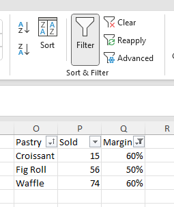

**********
AutoFilter
**********

AutoFilter can quickly sort and filter data in a range, either worksheet or a table.

The autofilter keeps sort state (indicated by upward arrow in column *Pastry* of the image) and
filters (indicated by funnel shape in *margin* column). There are several types of filters.

Through powerfull, there are some limitations:

* Sorting can be done only on one column
* There can be only one autofilter per worksheet, though each table can have its own autofilter.

The filter behaviors sometimes isn't consistent and has various weird edge cases. That is just
how Excel behaves and ClosedXML generally follows Excel, unless there is a good reason not to.

Define autofilter
=================

Autofilter can be defined for a worksheet or for a table. To define and enable it (=display the
arrows in header row) for a worksheet, define an area with a header row and call
``IXLRange.SetAutoFilter()`` method. For tables, call function with the same name
``IXLTable.SetAutoFilter()``. The returned object is of type ``IXLAutoFilter`` and can be used to
sort and filter the autofitler rows.

.. note::
   Autofilter for tables will not include totals row, i.e. it won't be included in filtering,
   sorting ect.

In both cases, the first row of the area will be a header row. The header row is never included in
sorting or filtering.

Clearing filter
---------------

Column filter settings can be cleared (i.e. arrow icons are kept) through
``IXLFilterColumn.Clear()`` method.

Reapply filters
---------------

``IXLAutoFilter.Reapply()`` method evaluates filter once again for data of autofilter. In most
cases, the reapplication is done automatically, but this method may come handy, if cell values or
workbook structure changes. In such case, the filter may be stale.

Removing autofilter
-------------------

Whole autofilter (i.e. icons disappear, rows are visible) can be done either through
``IXLAutoFilter.Clear()`` method, by setting ``IXLAutoFilter.IsEnabled`` to false or through
``IXLRange.SetAutoFilter(false)`` method.

Sorting
=======

Data in an autofilter range can be sorted using ``IXLAutoFilter.Sort()`` method. Once sorting is
done, the sorted state of the autofilter will be updated.

.. note::
   For detail about sorting algorithm and API, see :doc:`sorting page <sort>`. The autofilter
   sorting is limited to one column.

.. code-block:: csharp

   using var wb = new XLWorkbook();
   var ws = wb.AddWorksheet();
   var range = ws.Cell("B3").InsertData(new[]
   {
       new object[]{ "Pastry",    "Sold", "Margin" },
       new object[]{ "Cake",      14,     0.25 },
       new object[]{ "Croissant", 15,     0.60 },
       new object[]{ "Fig Roll",  56,     0.50 },
       new object[]{ "Waffle",    74,     0.60 },
   });

   // Sort by margin
   range.SetAutoFilter().Sort(3, XLSortOrder.Descending);
   wb.SaveAs(@"c:\temp\issues\autofilter-sort-example.xlsx");

Note the sort state indicator in *Margin* column.

Sort state
----------

The sort state is held by ``IXLAutoFilter.Sorted`` (indicating that range has been sorted),
``IXLAutoFilter.SortColumn`` (column that was used for sorting) and ``IXLAutoFilter.SortOrder``.
The latter two values contain undefined value for unsorted autofilter.

Filtering
=========

Data filtering is done by specifying a filter for a column. Filter defines a condition that must be
satisfied and if row satisfies conditions of all column filters, the row is visile, otherwise it is
hidden. Whole row in a worksheet is hidden/shown, thus even cells that don't belong to the
autofilter are hidden.

There are several filter types:

* **Regular filter** - filter contains a set of values and cell satisfies filter only if its value
  is contained in the set of filter values.
* **Custom filter** - conditions consists of a filter value and a comparator operator (e.g. ``>=``)
  that compares value of a cell with the filter value.
* **Dynamic filter** - a filter with dynamic values. The filter is named dynamic, because criteria can
  change, either with the data itself (e.g. "above average") or with the current date (e.g.
  show values for "today").
* **Top10** - display top or bottom items. The number of displayed items is either absolute or as a
  percentage of autorfilter data rows.

Each autofilter column can have at most one type of a filter. If you try to apply another type, the
original filter is replaced.

All methods to specify filter have a parameter ``reapply`` with default value ``true``. The parameter
determines whether the filter should be immediately reapplied or not. In cases where multiple
filters are specified, it's better to apply only the last change of filter configuration to
avoid multiple filter evaluations.

Regular filter
--------------

Regular filter in Excel is represented by an area with all possible values and user selects
a subset of values to display.

In API, you can add a value to the regular filter through ``IXLFilterColumn.AddFilter()`` method
or through ``IXLFilterColumn.AddDateGroupFilter()`` method for groups of dates.

A cell value that is same as one of filter values satisfies the regular filter.

Filter value is **always text** and the filter value is compared with formatted string of a cell
(``IXLCell.GetFormattedText()``). The API accepts ``XLCellValue``, but the argument is immediately
converted to string. Regular filter may contain multiple filter values.

.. note::
   The comparison is sensitive to current culture, e.g. *1.5* is converted to *1,5* in *cs-CZ*
   culture and if a workbook was saved in cs-CZ culture, the value in the file would also be
   *1,5*. It works as long as the culture stays same (formatted string also use *,* as decimal
   separator), but might won't work in different culture (e.g. in *en-US*, number *1.5* would
   have formatted string *1.5* that would be different from value *1,6* stored in the file.

Date group filter is another variation of regular filter. Date time group filter basically
specifies a date range, e.g. month or year and all dates in the date range satisfy the filter.
Multiple date time group filters can be specified at the same time.

Examples of ``IXLColumnFilter.AddDateGroupFilter()``:

* `AddDateGroupFilter(new DateTime(2020, 1, ignores), XLDateTimeGrouping.Month)` - all dates in month 2020-01.
* `AddDateGroupFilter(new DateTime(2020, ignored, ignored), XLDateTimeGrouping.Year)` - all dates in year 2020.
* `AddDateGroupFilter(new DateTime(2020, 7, 14), XLDateTimeGrouping.Day)` - all dates in day 2020-07-14.

Values that are not numbers, dates or timestamps never satisfy the filter. 

.. code-block:: csharp

   using var wb = new XLWorkbook();
   var ws = wb.AddWorksheet();
   ws.Column("B").Width = 12;
   var range = ws.Cell("B3").InsertData(new object[]
   {
       "Header",
       "Text",
       7,
       new DateTime(2020, 1, 5),
       new DateTime(2020, 1, 14),
       "7",
       new DateTime(2020, 2, 5)
   });

   range.SetAutoFilter().Column(1)
       .AddFilter("7", false)
       .AddDateGroupFilter(new DateTime(2020, 1, 1), XLDateTimeGrouping.Month);

   wb.SaveAs("autofilter-filter-regular-example.xlsx");

.. warning::
   The OpenXML SDK contain a validation error that indicates that regular filter value and date
   time group filter can't be specified together. and it throws an exception. As long as the
   ``validate`` parameter of ``XLWorkbook.SaveAs()`` method is not set to ``true`` (default is
   ``false``), the error won't manifest.

Custom filters
--------------

Custom filter compares value of a cell with filter value using a specified operand and determine
whether operand is true. If true, the filter is satisfied.

Compare filters
~~~~~~~~~~~~~~~

Generally speaking, comparison filters take the filter value type and only the values of the filter
type that satisfy comparison also satisfy the filter. E.g. when filter is > 7, only values that are
numbers and are greater satisfy the filter.

* Blanks never satisfy custom filter and are always filtered out.
* Logical only accept logical and ``true`` > ``false``.
* Numbers are compared using their value. DateTime and TimeSpan are considered number using their
  serial date time value.
* Text compares texts using case-insensitive current culture.
* Errors are compared by their `ERROR.TYPE` numerical value (e.g. ``#REF!`` is 4, ``#N/A`` is 7).

Custom filter compare filter methods:

* ``IXLFilterColumn.GreaterThan``
* ``IXLFilterColumn.EqualOrGreaterThan``
* ``IXLFilterColumn.EqualTo``
* ``IXLFilterColumn.NotEqualTo``
* ``IXLFilterColumn.EqualOrLessThan``
* ``IXLFilterColumn.LessThan``

.. code-block:: csharp

   using var wb = new XLWorkbook();
   var ws = wb.Worksheets.Add("AutoFilter");
   var range = ws.Cell("A1").InsertData(new object[] {
       "Number",
       2,
       14,
       4,
       5,
       8,
       -5,
   });

   var autoFilter = range.SetAutoFilter();
   autoFilter.Column(1).EqualOrLessThan(5);

   wb.SaveAs("autofilter-filter-custom-compare-example.xlsx");

Custom filter can use at most two comparisons, connected either by ``And`` or by ``Or`` logical
condition. Methods ``IXLFilterColumn.Between`` and ``IXLFilterColumn.NotBetween`` are convenience
methods using these connectors.

.. code-block:: csharp

   using var wb = new XLWorkbook();
   var ws = wb.Worksheets.Add("AutoFilter");
   var gradesRange = ws.Cell("A1").InsertData(new[] {
       "Grade",
       "F",
       "C",
       "C",
       "N/A",
       "A",
       "D",
   });
   
   // Add filters for failing grade. Skip immedate reapply for the first filter.
   gradesRange.SetAutoFilter().Column(1).GreaterThan("C", false).And.NotEqualTo("N/A");
   
   // Sort the filtered list
   ws.AutoFilter.Sort(1, XLSortOrder.Ascending);
   
   wb.SaveAs("autofilter-filter-custom-connector-example.xlsx");

Pattern filters
~~~~~~~~~~~~~~~

The operator ``XLFilterOperator.Equal`` and ``XLFilterOperator.NotEqual`` fulfill double duty.
If the filter value is non-text (e.g. **1**, **TRUE**, or *#N/A*), the operator uses comparison
semantic. If the filter value is a text, the filter use wildcard matching.

Wildcards are strings that can use special characters instead of actual ones. Character *****
means zero or more characters and **?**  one character. Character **~** is an escape character
if */? need to be matched in their literal sense (**~***).

Although it's possible to use operator ``EqualTo`` (e.g. ``range.EqualTo("String*")`` for filtering
text starting with *String*), there are several methods that match filters provided by Excel:

* ``IXLFilterColumn.BeginsWith(String)``
* ``IXLFilterColumn.NotBeginsWith(String)``
* ``IXLFilterColumn.EndsWith(String)``
* ``IXLFilterColumn.NotEndsWith(String)``
* ``IXLFilterColumn.Contains(String)``
* ``IXLFilterColumn.NotContains(String)``

.. code-block:: csharp

   using var wb = new XLWorkbook();
   var ws = wb.Worksheets.Add("AutoFilter");
   var gradesRange = ws.Cell("A1").InsertData(new[] {
       "Code",
       "CZ-144",
       "US-44",
       "FR-94",
       "CZ-84",
       "FR-98",
       "IN-94",
   });

   gradesRange.SetAutoFilter().Column(1).BeginsWith("CZ");

   wb.SaveAs("autofilter-filter-custom-pattern-example.xlsx");

Dynamic filter
--------------

The only dynamic filter supported so far is average filter. There are two methods:

* ``IXLFilterColumn.AboveAverage()``
* ``IXLFilterColumn.BelowAverage()``

If column uses dynamic filter (``IXLFilterColumn.FilterType == XLFilterType.Dynamic``), the filter
state is stored in the ``IXLFilterColumn.DynamicType`` and ``IXLFilterColumn.DynamicValue``
properties.

.. code-block:: csharp

   using var wb = new XLWorkbook();
   var ws = wb.Worksheets.Add("AutoFilter");
   var gradesRange = ws.Cell("A1").InsertData(new object[] {
       "Value",
       1,
       1,
       1.7,
       1.75,
       1.8,
       2,
       3
   });

   // Average is 1.75 and it is not included.
   gradesRange.SetAutoFilter().Column(1).AboveAverage();

   wb.SaveAs("autofilter-filter-dynamic-average-example.xlsx");

Top10 filter
------------

Top10 filters filter a top or bottom items of a column. Number of items can be explicitely
specified or defined as a percentage of data row count in the autofilter.

.. note::
   Filter doesn't always keep required number of items. The top10 filter determines a cutoff
   value for the filter and all values above/below the cutoff are taken. If there are duplicate
   values, they are retained.
   
   E.g. bottom 2 of sequence *1, 2, 2, 3* will be *1, 2, 2*.

If column uses top10 filter (``IXLFilterColumn.FilterType == XLFilterType.TopBottom``), the filter
state is stored in the ``IXLFilterColumn.TopBottomValue``, ``IXLFilterColumn.TopBottomType`` 
and ``IXLFilterColumn.TopBottomPart`` properties.

.. code-block:: csharp

   using var wb = new XLWorkbook();
   var ws = wb.Worksheets.Add("AutoFilter");
   var gradesRange = ws.Cell("A1").InsertData(new object[] {
       "Top 25%",
       1, 2, 3, 4, 5, 6, 7, 8, 9, 10, 11, 12,
   });

   gradesRange.SetAutoFilter().Column(1).Top(25, XLTopBottomType.Percent);

   wb.SaveAs("autofilter-filter-top10-example.xlsx");

