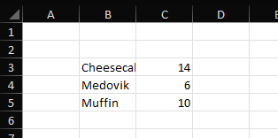

================
Bulk insert data
================

Inserting a larger amount of data can be done using `IXLCell.InsertData` methods. Methods will insert data to cells staring from the referenced cell.

There are several possible inputs. ClosedXML doesn't add header for bulk data insert.

*********
DataTable
*********
You can insert data directly from `DataTable`. This feature is useful if you work with **ADO.NET**.

.. code-block:: csharp

   var dataTable = new DataTable();
   dataTable.Columns.Add("Name", typeof(string));
   dataTable.Columns.Add("Sold", typeof(int));

   dataTable.Rows.Add("Cheesecake", 14);
   dataTable.Rows.Add("Medovik", 6);
   dataTable.Rows.Add("Muffin", 10);

   using var wb = new XLWorkbook();
   var ws = wb.AddWorksheet();
   ws.Cell("B3").InsertData(dataTable);
   wb.SaveAs("Demo-Bulk-Insert-Data-DataTable.xlsx");

******************
Generic Enumerable
******************

Insert data from a generic `IEnumerable<>`. The data inserted differ depending on the type of an item type of the `IEnumerable<>`.

A method used to insert the values from a generic `IEnumerable<>` is the `IXLCell.InsertData(IEnumerable data)`, despite the parameter not being generic `IEnumerable<>`.

Structure of all items is determined by the generic parameter type.

Objects or structs
##################

Items of the `IEnumerable<>` are an object or struct (e.g. DTO). All public fields and properties (instance or static), will be used as a source of data for columns. Members can be nullable and indexers are ignored.

The way members are processed can be modified by adding a `XLColumnAttribute`:

* A member can be ignored through `[XLColumn(Ignore = true)]`
* The order of members in a class is undefined. Use `[XLColumn(Order=1)]` to specify the order.

.. code-block:: csharp

   public record Dessert(
       [property:XLColumn(Ignore = true)] int SellerId,
       [property:XLColumn(Order = 1)] string Name,
       [property:XLColumn(Order = 2)] int Sales);

   var data = new[] {
       new Dessert(1, "Cheesecake", 14),
       new Dessert(2, "Medovik", 6),
       new Dessert(2, "Muffin", 10),
   };

   using var wb = new XLWorkbook();
   var ws = wb.AddWorksheet();
   ws.Cell("B3").InsertData(data);
   wb.SaveAs("Demo-Bulk-Insert-Data-Objects.xlsx");

IEnumerable
###########

Items of `IEnumerable<>` is another type implementing IEnumerable (e.g. array or `List`). The items of the nested `IEnumerable` must be assignable to a cell.

.. code-block:: csharp

   var data = new List<object[]>
   {
       new object[] { "Cheesecake", 14 },
       new object[] { "Medovik", 6 },
       new object[] { "Muffin", 10 }
   };

   using var wb = new XLWorkbook();
   var ws = wb.AddWorksheet();
   ws.Cell("B3").InsertData(data);
   wb.SaveAs("Demo-Bulk-Insert-Data-Enumerable.xlsx");

IDataRecord
###########

Items of `IEnumerable<>` implement interface `System.Data.IDataRecord`.

Simple type
###########

Items of `IEnumerable<>` are a primitive type, `string`, `DateTime`, `TimeSpan`, or a number. Type of the items can also be nullable (e.g. `int?`).

Simple type items always inserts only one column.

DataRow
#######

Items of `IEnumerable<>` are a `DataRow`. ClosedXMl behaves like when inserting data from `DataTable`.

*******************
Untyped Enumerable
*******************

Mostly used for untyped collections, like `ArrayList`.

Types of items behave same way as for the generic enumerable.

ClosedXML can handle a case where each item is of different type.

.. code-block:: csharp

   public record Dessert(
       [property: XLColumn(Ignore = true)] int SellerId,
       [property: XLColumn(Order = 1)] string Name,
       [property: XLColumn(Order = 2)] int Sales);

   var data = new ArrayList
   {
       new object[] { "Cheesecake", 14 },
       new Dessert(1, "Medovik", 6),
       new object[] { "Muffin", 10 },
   };

   using var wb = new XLWorkbook();
   var ws = wb.AddWorksheet();
   ws.Cell("B3").InsertData(data);
   wb.SaveAs("Demo-Bulk-Insert-Data-UntypedEnumerable.xlsx");
