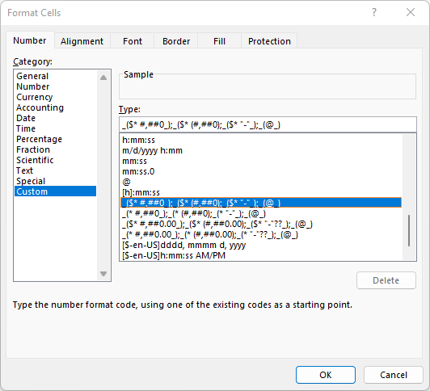
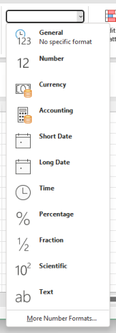
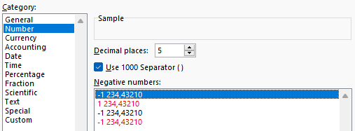
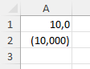
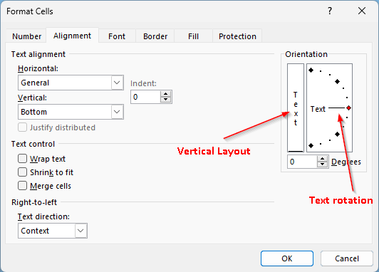
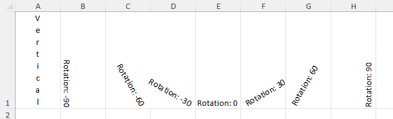

Cell styles
***********

Cells can be styled, their background, border, font of the content and many other options.

Fluent vs properties
####################
The style can be set through properties or through fluent API. Both style produce same result.

.. code-block:: csharp

   // Set style through property
   ws.Cell("A1").Style.Font.FontSize = 20;
   ws.Cell("A1").Style.Font.FontName = "Arial";

   // Set style using fluent API
   ws.Cell("A1").Style
       .Font.SetFontSize(20)
       .Font.SetFontName("Arial");

Font
####

.. code-block:: csharp

   ws.Cell("A1").Style
       .Font.SetFontSize(20)
       .Font.SetFontName("Arial");

Background color
-------------------

.. code-block:: csharp

	ws.Cell("A1").Style
		.Fill.SetBackgroundColor(XLColor.Red);

-----------
Cell border
-----------
You can set a border of a cell.

.. code-block:: csharp

   // Default color is black
   ws.Cell("B2").Style
       .Border.SetTopBorder(XLBorderStyleValues.Medium)
       .Border.SetRightBorder(XLBorderStyleValues.Medium)
       .Border.SetBottomBorder(XLBorderStyleValues.Medium)
       .Border.SetLeftBorder(XLBorderStyleValues.Medium);

Number format
#############

Excel has an ability to format a value in a cell through a built-in number
format or through a custom number format code.

ClosedXML can set format of a cell or a range through ``IXLStyle.NumberFormat``
property. The property can be found on interfaces of ranges, e.g. ``IXLCell``,
``IXLCells`` or ``IXLRangeBase``. The built-in style is set by setting
a (in theory well known) number format id. Custom style is set by setting
a number format code.

Built-in number format
----------------------

To use built-in number format, first determine a number format id.
ClosedXML contains a subset of common format ids (0..49) in a static class
``XLPredefinedFormat`` or you can just pick an integer from OpenXML SDK
documentation `NumberingFormat Class <https://learn.microsoft.com/en-us/dotnet/api/documentformat.openxml.spreadsheet.numberingformat>`_.

.. warning::
   The built-in formats are identified in an excel only as an id, but actual
   formatting for for the built-in formats differs depending on a locale
   of the Excel.

   As an example, built-in format 20 (``XLPredefinedFormat.DateTime.Hour24Minutes``)
   uses formatting string *h:mm* for en-US locale, but *hh:mm* in en-GB locale.
   That means, if the same workbook is opened in US Excel, Excel will display *8:25*,
   but if the same workbook is opened in UK Excel, it will display *08:25*.

   *en-US* and *en-GB* both use english, so the built-in format can differ even
   for the same language in different territories, not just different languages.

   Some locales also have more built-in formats than others, e.g *th-th* locale
   has some ids that are over 80.

You can set a built-in number format by setting a ``NumberFormatId`` property like this:
``ws.Cell("A1").Style.NumberFormat.NumberFormatId = (int)XLPredefinedFormat.Number.PercentInteger``

ClosedXML doesn't contain all possible values for all locales. You either
have to look through specification (ECMA-376 18.8.30), but it is not
exhaustive.

The other option just change the value in the saves excel (`/xl/styles.xml`,
tag `xf`, attribute `numFmtId`) and observe results in different locales.
On Windows, you can change locale through Settings dialogue:
 * Open *Settings*
 * Go to *Time & language* on the left panel
 * Open *Language & region *in the right panel
 * Change *Regional format*
 * Restart Excel

Custom number format
--------------------

Number format can be more tailored through a custom format code. All formats,
that are not built-in, use custom format code, e.g. if you specify in the format
in Excel dialogue to display value as a number with 5 decimal digits and to use 1000
serparator, Excel will store the format in the file as ``#,##0.00000``.

The format code can be rather complicated, but is well described in official
documentation `Number format codes <https://support.microsoft.com/en-us/office/number-format-codes-5026bbd6-04bc-48cd-bf33-80f18b4eae68>`_
or the chapter 18.8.31 of the ECMA-376.

.. code-block:: csharp

   using var wb = new XLWorkbook();
   var ws = wb.AddWorksheet();
   var format = "#,##0.0; (#,##0.000)";

   ws.Cell("A1").Value = 10;
   ws.Cell("A1").Style.NumberFormat.Format = format;

   ws.Cell("A2").Value = -10;
   ws.Cell("A2").Style.NumberFormat.Format = format;
   wb.SaveAs("cell-format-custom-format.xlsx");

Neither built-in number format nor custom number format change the value of
a cell. The value stays the same, only presentation of the value changes.
It is possible to get formatted string ``IXLCell.GetFormattedString()``
method.

.. warning::
   The format code in the xlsx file must be in some cases escaped, but
   ClosedXML doesn't do that at the moment. If you encounter a problem
   that value isn't formatted correcty, set the format in an Excel,
   save the xlsx file, change the *xlsx* extension to *zip* and use
   correctly escaped format code from `/xl/styles.xml` file in the zip.

Orientation
###########

Text in a cell can be rotated by an angle, either in a clockwise or in a
counterclokwise direction. Text can't be rotated more that 90 degrees in
either direction (i.e. *upside down*). In addition, text can also orienteted
vertically, where each letters are laid out in vertical direction, instead
of horizontally.

The sample demonstrates how to set text rotation with various angles and
how to set vertical layout of a text.

.. code-block:: csharp

   using ClosedXML.Excel;
   
   using var wb = new XLWorkbook();
   var ws = wb.AddWorksheet();
   ws.ColumnWidth = 10;
   ws.Cell(1, 1)
       .SetValue("Vertical")
       .Style.Alignment.SetTextRotation(255);
   
   for (var angle = -90; angle <= 90; angle += 30)
   {
       var column = angle / 30 + 5;
       ws.Cell(1, column)
           .SetValue($"Rotation: {angle}")
           .Style.Alignment.SetTextRotation(angle);
   }
   
   wb.SaveAs("cell-format-alignment-orientation.xlsx");

Phonetics
#########

East Asian languages (e.g. Japanese) sometimes use phonetic 'hints' above parts
of the text. In order to see the hints and the GUI option, it is necessary to
switch "Office authoring language and proofing" to supported language. At this
moment, only Japanese is supported. Excel won't show hints/button in other
languages.

.. image:: img/cell-format-phonetic.png
  :alt: Furigana and a toggle to display phonetic information.

In order to show furigana, phonetic information has to be added to the rich
text and a property ``ShowPhonetics`` must be set for the cell.

.. code-block:: csharp

   using var wb = new XLWorkbook();
   var ws = wb.AddWorksheet();
   var cell = ws.Cell(1, 1);

   // First we add the text. It is alwayes displayed
   cell.GetRichText().AddText("みんなさんはお元気ですか。").SetFontSize(16);

   // And then we add the phonetics
   cell.GetRichText().Phonetics.SetFontSize(8);
   cell.GetRichText().Phonetics.Add("げん", 7, 8);
   cell.GetRichText().Phonetics.Add("き", 8, 9);

   // Must set flag to actually display furigana
   cell.ShowPhonetic = true;

   wb.SaveAs("cell-format-phonetics.xlsx");

Font scheme
###########

Font can depend on a font scheme through property ``IXFontBase.FontScheme``.
Font scheme associates text with one of fonts of a theme. Theme has major font
scheme (headings and such) and a minor font scheme (paragraphs, body ect.).

Font scheme is part of a style and can be set for a content of a ``IXLCell``,
``IXLRichText`` and other places.

.. note::
   Font scheme has a precedence over specified font. Even if text has
   explicitely specified font, Excel will use and display font from the font
   scheme.
   
   Example: Although ``ws.Cell("A1").SetValue("Text").Style.Font.SetFontName("Consolas").Font.SetFontScheme(XLFontScheme.Major);``
   specifies that ``Text`` should be displayed with font *Consolas*, Excel
   will use font of the major scheme (for default theme, it is *Cambria*).

When user changes a theme, Excel dynamically updates font of texts associated
with the font scheme to the font of selected theme.

.. image:: img/cell-format-rich-text-scheme.png
  :alt: A demonstration of how the text looks before theme change and after theme change.

.. code-block:: csharp

   using var wb = new XLWorkbook();
   var ws = wb.AddWorksheet();
   var cell = ws.Cell(1, 1);
   cell.Style.Font.FontSize = 25;
   
   cell.GetRichText()
       .AddText("Major scheme")
           .SetFontScheme(XLFontScheme.Major)
       .AddText(" ")
       .AddText("Minor scheme")
           .SetFontScheme(XLFontScheme.Minor)
       .AddText(" ")
       .AddText("No scheme")
           .SetFontName("Century")
           .SetFontScheme(XLFontScheme.None);

   wb.SaveAs("cell-format-font-scheme.xlsx");
