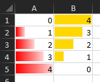
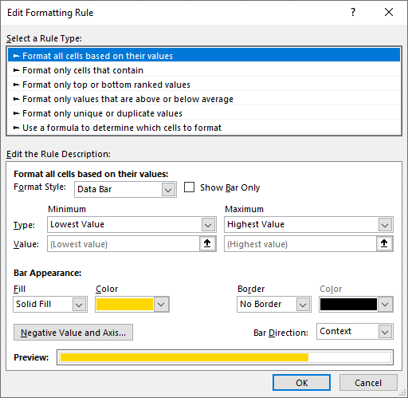

************
Conditional Formatting
************
Conditional formatting can be applied to ranges of cells in Excel based on their values. 

The following formatting types are available:
* 2-Color Scale
* 3-Color Scale
* DataBar
* Icon Sets

DataBar
#######
The following example code shows how to configure DataBar conditional formatting based on the value of the cells in the range.

.. code-block:: csharp

   ws.FirstCell().SetValue(0)
      .CellBelow().SetValue(1)
      .CellBelow().SetValue(2)
      .CellBelow().SetValue(3)
      .CellBelow().SetValue(4);

   ws.Range("A1:A5")
      .AddConditionalFormat()
      .AddDataBar(XLColor.Red)
      .LowestValue()
      .HighestValue()
      .SetGradient(true);

   ws.Cell("B1").SetValue(4)
         .CellBelow().SetValue(3)
         .CellBelow().SetValue(2)
         .CellBelow().SetValue(1)
         .CellBelow().SetValue(0);

   ws.Range("B1:B5")
      .AddConditionalFormat()
      .AddDataBar(XLColor.Gold)
      .LowestValue()
      .HighestValue()
      .SetGradient(false);

