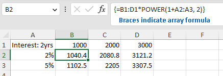

########
Formulas
########

****************
Feature overview
****************

Cell of a workbook can have formulas, i.e. a recipe to calculate the output
value from other cell values, constants, operations and functions.

Excel supports four types of formulas:

* Normal - Formula calculates a single value and the result of the calculation
  is set as a value of the cell.
* Array - A range of cells are calculated at once, using a single formula.
  Array formula can be set even on a single cell, which results in a 1x1 array
  formula.
* Data table - Used for what-if analysis, uses a formula along with a set of
  values to calculates a range of values (e.g. calculate monthly payment based
  on the mortgage rate and amount financed).
* Shared - this is basically a memory optimization, where many cells reference
  the same formula.

*************
Available API
*************

Array formulas
==============

Set an array formula
--------------------

Select an area of cells to set the array formula and then set the formula
through `IXLRangeBase.FormulaArrayA1` setter.

.. code-block:: csharp
   
   using var wb = new XLWorkbook();
   var ws = wb.AddWorksheet();
   ws.Cell("A1").Value = "Interest: 2yrs";
   ws.Cell("B1").Value = 1000;
   ws.Cell("C1").Value = 2000;
   ws.Cell("D1").Value = 3000;
   ws.Cell("A2").SetValue(0.02)
       .Style.NumberFormat.SetNumberFormatId((int)XLPredefinedFormat.Number.PercentInteger);
   ws.Cell("A3").SetValue(0.05)
       .Style.NumberFormat.SetNumberFormatId((int)XLPredefinedFormat.Number.PercentInteger);
   
   ws.Range("B2:D3").FormulaArrayA1 = "B1:D1*POWER(1+A2:A3, 2)";
   
   wb.SaveAs("array-formula-create.xlsx");

When a cell is a part of an array formula,

* its ``IXLCell.FormulaA1`` getter will return the array formula (no braces).
* the ``IXLCell.HasArrayFormula`` getter return ``true``
* the ``IXLCell.FormulaReference`` getter return the area of the array formula.

It's not possible to create an array formula that would intersect with a merged
range, table or partially overlaps another array formula. Doing so will throw
``InvalidOperationException``. If new array formula completely covers existing
array formula, there isn't an exception.

Clear array formula
-------------------

In order to clear an array formula, set a range covering the formula to a
value. Any value will do, though it will be ``Blank.Value`` in most cases.
The range can be determined through the ``IXLCell.FormulaReference`` property
or explicitely set.

.. code-block:: csharp

   using var wb = new XLWorkbook();
   var ws = wb.AddWorksheet();
   ws.Range("A1:C2").FormulaArrayA1 = "SIN(PI()/2)";
   
   // This will clear the formula.
   ws.Range(ws.Cell("A1").FormulaReference).Value = Blank.Value;
   
   wb.SaveAs("array-formula-clear.xlsx");

Data table
==========

Data table formulas can be read and written, but manipulation doesn't work.
