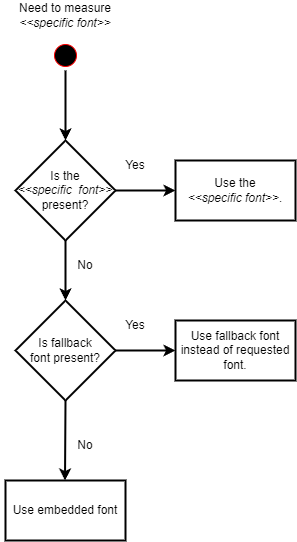

##############
Graphic Engine
##############

.. note::
   For problems with a missing font exception, please see
   `missing fonts </en/latest/tips/missing-font.html#solutions>`_ page.

**********
Background
**********

ClosedXML used to use a library *System.Drawing.Common* in order to read
pictures and measure text. When .NET Standard and .NET Core arrived, Microsoft
split off a pieced of part of from .NET Framework and it worked by calling Win32
GDI API+ on Windows and by calling *libgdiplus* library on Linux.

As of .NET 6, a lot of pieces have become effecively unmaintained and
replacement in the .NET ecosystem have become sufficiently mature. .NET team
has decided to officialy make System.Drawing.Common library Windows only
library.

For more info, see the `Make System.Drawing.Common only supported on Windows <https://github.com/dotnet/designs/blob/main/accepted/2021/system-drawing-win-only/system-drawing-win-only.md>`_
design document.

Since System.Drawing.Common has become Windows-only, it had to be replaced in
ClosedXML with an alternative that would work on multiple platforms (Windows,
Linux, AWS, Azure Function, Android, Blazor...). To isolate ourselves from
other potential library changes, the required functionality has been hidden
behind new ``IXLGraphicEngine`` interface.

There several drawbacks of replacing System.Drawing.Common:

* Font dependency - System.Drawing.Common always had at least some font available (e.g.
  ``System.Drawing.FontFamily.GenericSansSerif``). That is no longer true.
* Performance - In most cases, System.Drawing.Common was only a wrapper over
  a system library that had fonts stored in memory and it wasn't necessary to
  load them again for each program. That is no longer true.

**************
Graphic Engine
**************

Graphic Engine is an pluggable component (since `0.97.0`) hidden behind
``IXLGraphicEngine`` interface that is responsible for working with image
formats and fonts. Both image reading and rendered size measurement is a
non-trivial problem that is out of scope of ClosedXML.

The font measurements is mostly used by ``AdjustToContent``. Image reading
detects size and format of images added to workbook.

Engine Creation
===============

ClosedXML contains a ``DefaultGraphicEngine`` that implements the
``IXLGraphicEngine``. It is able to read information about png, jpeg, gif,
baseline tiff, bmp, tiff, emf, wmf, webp and pcx file formats. It uses
``SixLabor.Fonts`` library to measure size of text rendered in a specified
font. It requires a fallback font that is used, when workbook needs to measure
a size of a text with a font, that is not available. That happens especially
on non-windows environments, where *Calibri* font (default font of workbooks)
is not available.

There are several ways to get the engine that differ by where they get fonts.

Default engine
--------------

There is an default instance ``ClosedXML.Graphic.DefaultGraphicEngine.Instance``
used by ClosedXML by default. It uses "Microsoft Sans Serif" as a fallback font
and uses any system font available to *SixLabor.Fonts*.

ClosedXML uses this engine, if no other is specified.

.. flat-table:: Methods to get graphic engine
   :header-rows: 1

   * - Creation method
     - Fallback font
     - Can load non-system fonts
     - Loads system fonts
	 - Usage

   * - ``ClosedXML.Graphic.DefaultGraphicEngine.Instance``
     - *Microsoft Sans Serif*
     - No
     - Yes
	 - Used on windows environments.

   * - ``new DefaultGraphicEngine(string fallbackFontName)``
     - Depends on provided font name
     - No
     - Yes
	 - Used for simple setting of a different fallback font on non-windows environments that is available in system fonts, e.g. *Tahoma*/*DejaVu Sans* or *Carlito* (font that closely resembles Calibri).

   * - ``DefaultGraphicEngine.CreateOnlyWithFonts(Stream fallbackFontStream, params Stream[] fontStreams)``
     - Depends on provided font stream
     - Yes
     - No
	 - Used by environments without access to any font (e.g. Blazor) or where all fonts are bundled along with the application. It might also be useful for performance reasons.

   * - ``DefaultGraphicEngine.CreateWithFontsAndSystemFonts(Stream fallbackFontStream, params Stream[] fontStreams)``
     - Depends on provided font stream
     - Yes
     - Yes
	 - Application has extra fonts it wants to use, but it also wants to use system fonts.

The *SixLabor.Fonts* looks for system fonts at various places for various
environments, for deails look at the `source <https://github.com/SixLabors/Fonts/blob/main/src/SixLabors.Fonts/SystemFontCollection.cs#L27>`_).

The options that don't load system fonts might be better for performance
reasons, because font name doesn't have to correspond to the font file name
(e.g. *Microsoft Sans Serif* is stored in *micross.ttf* file). SixLabor.Fonts
thus has to check the content of the file to find out what font does it contain.

It **might** be benficial to load font files to memory stream and pass
the stream back to the ``DefaultGraphicEngine``. It improved
startup time in some test cases and didn't in others. *SixLabors.Fonts* read
data in small chunks (generally less than 4 bytes) and in some cases, it might
be better just to read whole file into memory and pass it to the the engine
(e.g. ``DefaultGraphicEngine.CreateOnlyWithFonts(new MemoryStream(File.ReadAllBytes("Carlito.ttf")))``).

Fallback and embedded font
==========================

A font is required for a significant amount of features. There is no
standardized list of fonts available on every environment and workbook
can contain text that use unavailable fonts.

To ensure there is always some font present, there is one embedded in the
assembly. It is a stripped version of a Carlito font (Calibri metric compatible
font) that contains basically only metric information of glyphs (i.e. no glyph
outlines, no ligatures or other substitions and various font features).

The embedded font uses a different name from Carlito to avoid potential name
collision.

   
This should achieve the following goals:

* On Windows, fallback font is *Microsoft Sans Serif*. That is how Excel
  behaves and there could be some suble consequnces if embedded font was used.
  E.g. different default pixel width of a column, if font of a normal style
  of a workbook isn't present and fallback has to be used due to difference of
  maximum digit width.
* On environments without a font or with a limited font selection, an embedded
  font that is metric-compatible with Calibri will be used. That will produce
  correct column widths for `AdjustToContent` methods.
* User can use a specific fallback font that is present at the environment.

Set engine
==========

You can specify a different engine globally or individually for each workbook.
Global level is done by through a static `LoadOptions.DefaultGraphicEngine` property

.. code-block:: csharp

   LoadOptions.DefaultGraphicEngine = new DefaultGraphicEngine("Carlito");

   // All workbooks created after setting of the engine will use the specified engine.
   using var workbook = new XLWorkbook();

If you need to specify an engine on per-workbook basis, use the `LoadOptions.GraphicEngine` property

.. code-block:: csharp

   // Only workbooks created with the options will use the engine
   var loadOptions = new LoadOptions
   {
       GraphicEngine = new DefaultGraphicEngine("Carlito")
   };
   using var workbook = new XLWorkbook(loadOptions);

Workbook will use the first available engine found int the following order:

* ``LoadOptions.GraphicEngine`` - if user specified a specific engine just for the workbook, use that.
* ``LoadOptions.DefaultGraphicsEngine`` - is user specified default engine for all new workbooks, use that.
* ``DefaultGraphicEngine.Instance`` - a graphic engine that uses `SixLabors.Fonts` library and a custom picture parsing

How to use in Blazor
====================

Client-side Blazor can't use filesystem and the default instance isn't very
useful for them, because it loads system fonts from the filesystem. In
a situation where filesystem is not available, it is possible to use
a constructor of `DefaultGraphicEngine.CreateOnlyWithFonts` factory method
that accepts a stream containing a fallback font stream.

.. code-block:: csharp

   using Stream fallbackFontStream = Assembly.GetManifestResourceStream("SomeEmbeddedFont.ttf");
   LoadOptions.DefaultGraphicEngine = DefaultGraphicEngine.CreateOnlyWithFonts(fallbackFontStream);

Stream must be seekable, so unfortunately it is no possible to load font
directly from S3 or other http place without an intermediate stream.

There is also a possibility to load some additional fonts through streams, not
just fallback one. That can be done by passing an extra streams to
the constructor.

.. code-block:: csharp

   using Stream fallbackFontStream = Assembly.GetManifestResourceStream("SomeEmbeddedFont.ttf");
   using Stream calibriFont = /* a way to get stream for a font */;
   using Stream arialFont = /* a way to get stream for a font */;
   LoadOptions.DefaultGraphicEngine = DefaultGraphicEngine.CreateOnlyWithFonts(fallbackFontStream, calibriFont, arialFont);

Additional fonts are used in lieu of fallback font, if the cell contains one of the passed fonts.
