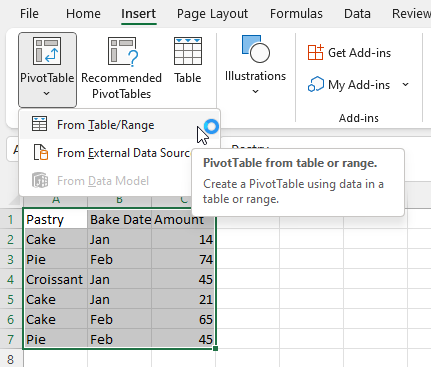
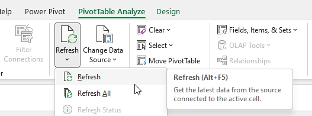
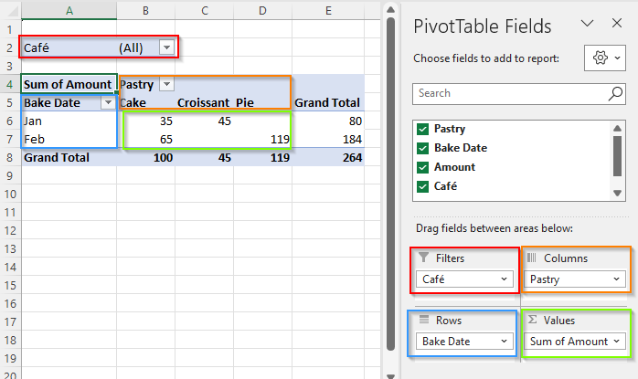
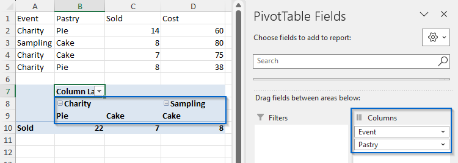
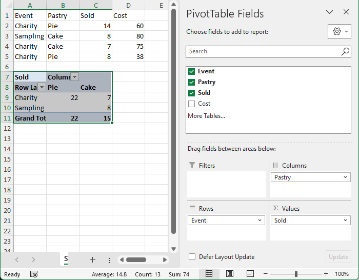
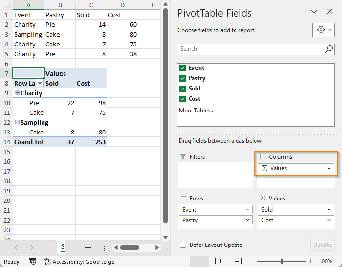
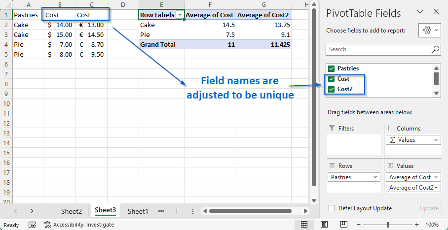
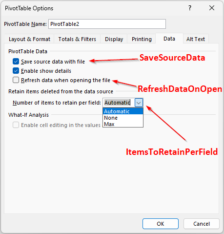

************
Pivot tables
************

Pivot table is a tool that can summarize data from a range of cells and display
summarized data in a second table that is called pivot table.

Pivot table structure
=====================

This chapter describes how is pivot table represented: 

* Pivot cache - a data store that contains all values from the source range.
* Pivot table - a table in a workbook that displays summarized data from the
  pivot cache.
* Pivot fields - a row or column in a pivot table. In most cases, it is
  a representation of a column from the cache, but it cann be also a part
  (year, month, day) of a date column.
* Pivot value fields - values displayed in a data area of a table.

Pivot Cache (`IXLPivotCache`)
-------------------------------

Pivot cache stores a copy of data from the original data source. It is a cache
and the data are not updated automatically, user has to call
`IXLPivotCache.Refresh()` to update them. Each column in the original source
represents a field that can be displayed in a pivot table.

One pivot cache can be used by multiple pivot tables. That allows for a
different summarization of a underlaying data without an expensive data
duplication.

All pivot caches in a workbook are accessible through `XLWorkbook.PivotCaches`
collection. The cache for a specific pivot table can be retrieved through
`IXLPivotTable.PivotCache` property.

Pivot Table (`IXLPivotTable`)
-----------------------------

Pivot table transforms data from the pivot cache to display a summary
information. Pivot table takes data from a some fields from the cache and uses
them to display the data in a tabular form.

The rows/columns of the pivot table contain distinct values of the row/column
fields and the value fields contain calculated values (e.g. sum or average)
of all values in a cache that belong to the record that contains values of
respective row/column in the pivot table.

All pivot tables for a worksheet are accessible through `IXLWorksheet.PivotTables`
collection.

Row/Column Fields (`IXLPivotField`)
^^^^^^^^^^^^^^^^^^^^^^^^^^^^^^^^^^^

Row/Column pivot table fields of a pivot tables contain a distinct values from
the pivot cache for their field. The values are displayed across the axis of
the field.

Notice that only *distinct* values are displayed and also only the combination
that exist in the cache. There is no "Sampling", "Pie" columns, because there
is no such row in the cache and thus no summarization can be done for such
values.

Row/Column pivot field determines

* order in which are values displayed in a row/column of a pivot table
* which values are shown and which are hidden in a row/column of a pivot table
* whether subtotals should be shown for a field values and how should subtotals be calculated.

Row fields of a pivot table are stored and can be added/deleted in the
`IXLPivotTable.RowLabels` collection and column fields in
`IXLPivotTable.ColumnLabels` collection.

Value Fields (`IXLPivotValue`)
^^^^^^^^^^^^^^^^^^^^^^^^^^^^^^

Value pivot table fields are display data in a summarized form. It determines

* How should the value of a data cell be summarized (e.g. sum or count)
* How should the values be shown to the user (e.g. directly as a value or
  as a difference from previous value)
  
Value fields are stored and can be added/deleted through `IXLPivotTable.Values`
collection. The calculation method for the field can be set through
`IXLPivotValue.Calculation` property.

Report Fields (`IXLPivotField`)
^^^^^^^^^^^^^^^^^^^^^^^^^^^^^^^

Report fields are used to filter all data in a pivot table. They are stored in
a `IXLPivotTable.ReportFilters` collection. Although they also use
`IXLPivotField` interface, many properties don't do anything.

Pivot Styles
------------

Pivot table can be stylized. The styling is a made out of a collection of
tuples `area-style`. Each cell of a pivot table is is evaluated against a list
of conditions and if cell satisfies all conditions, the style is applied to
the cell (multiple styles can apply and be composed). Conditions are varied,
e.g.

* Is cell in a column fields area?
* Does cell lie on a row of a specific field?
* Is the field collapsed?
* Does cell lie on a 3rd row of a field "Pastry"?

The conditions are dynamically evaluated and applied, e.g. when user collapses
a row in the pivot table and conditions are reevaluated and styles reapplied.

Styles are set through `IXLPivotField.StyleFormats`. The style itself is set to
the `IXLPivotStyleFormat.Style` property and conditions are set through other
properties.

Basic usage
============

Classic pivot table
-------------------

In order to create a pivot tables, you have to 

* Create a range (or a table) with data. Each column must have a text value
  that is used as a field name and values.
* Add pivot table to the worksheet. Make sure there is enough space and don't
  overwrite data in the original range. A common practice is to to place the
  pivot table to a new worksheet, like Excel does.
* Add a label field to the pivot table row/column axis. The name of the field
  must be present in the pivot cache.
* Add a value field to summarize the data and specify the summary formula that
  will calculate the displayed value. The default method is a *sum*, but it's
  explicitely set in the sample for clarity.
* Set labels, styles ect.

.. code-block:: csharp

   using var wb = new XLWorkbook();            
   var ws = wb.AddWorksheet();
   var range = ws.FirstCell().InsertData(new object[]
   {
       ("Event", "Pastry", "Sold", "Cost"),
       ("Charity", "Pie", 14, 60),
       ("Sampling", "Cake", 8, 80),
       ("Charity", "Cake", 7, 75),
       ("Charity", "Pie", 8, 38),
   });
   
   var pivotTable = ws.PivotTables.Add("pvt", ws.Cell(7, 1), range);
   pivotTable.RowLabels.Add("Event");
   pivotTable.ColumnLabels.Add("Pastry");
   pivotTable.Values.Add("Sold").SetSummaryFormula(XLPivotSummary.Sum);
   pivotTable.SetShowGrandTotalsColumns(false);
   
   wb.SaveAs("pastry.xlsx");

            

Labels only on one axis
-----------------------

It's not necessary to set fields on both row and column axis. It's enough to
specify fields only on one axis and values fields. In such case, the columns
will be the calculation of the value fields. Excel displays it as a *Σ Values*
artificial field (see the screenshot).

.. code-block:: csharp

   using var wb = new XLWorkbook();   
   var ws = wb.AddWorksheet();
   var range = ws.FirstCell().InsertData(new object[]
   {
       ("Event", "Pastry", "Sold", "Cost"),
       ("Charity", "Pie", 14, 60),
       ("Sampling", "Cake", 8, 80),
       ("Charity", "Cake", 7, 75),
       ("Charity", "Pie", 8, 38),
   });
   
   var pivotTable = ws.PivotTables.Add("pvt", ws.Cell(7, 1), range);
   pivotTable.RowLabels.Add("Event");
   pivotTable.RowLabels.Add("Pastry");
   pivotTable.Values.Add("Sold").SetSummaryFormula(XLPivotSummary.Sum);
   pivotTable.Values.Add("Cost").SetSummaryFormula(XLPivotSummary.Sum);
   pivotTable.SetShowGrandTotalsColumns(false);
   
   wb.SaveAs("pastry.xlsx");

Pivot Table Cache
==================

Pivot cache is a cache of data from a worksheet that are used to display the
pivot table. Each column from the source range is represented by a field in the
pivot cache.

Refresh
-------

Data in the pivot cache are not updated automatically, when the data in
a worksheet change. In order to update the data from the source, they must be
refreshed. The content of the pivot table will be updated to reflect the new
data. E.g.

* If a field was removed, it is also removed from the pivot table.
* Calculated values in the table can change.
* Values across row/column axis can change.

Refresh data from the source through `IXLPivotCache.Refresh()` method.

If you need to refresh all pivot tables, iterate over the individual caches
from `XLWorkbook.PivotCaches` and call `IXLPivotCache.Refresh()`
individually.

Field names
-----------

Names of fields in a pivot cache can be retrieved from `IXLPivotCache.FieldNames`
property. Every field name is unique string and field names are case-insensitive.

Field names are taken from top row of the source range. If value isn't
a string, it is converted to a string and used as a field name (e.g. number 12
will bu turned into a string *12*).

If the source range contains potentially duplicate field names, the field names
will be different in the pivot cache than in the range. That will be achieved
by adding a number at the end of a field name, e.g. if there are two columns
with name *Cost*, the pivot cache will contain field *Cost* and field *Cost2*.

Options
-------

`IXLPivotCache` can set options that affect what should Excel do with pivot cache.

* `IXLPivotCache.SaveSourceData` - Should pivot cache be saved to the file?
  Saving data will cause file to be larger, but it will load faster. Also,
  the source of data might be an external workbook that might not be available
  in the future. Default is *true*.
* `IXLPivotCache.RefreshDataOnOpen` - Should Excel refresh pivot caches and
  tables when it opens the workbook? Default is *false*, though Excel refreshes
  them anyway, because ClosedXML doesn't save content of a pivot table properly
  at the moment.
* `IXLPivotCache.ItemsToRetainPerField` - This option influences, whether
  field values should be shown in various filters of pivot tables, even after
  they were deleted from the source range and the pivot cache was refreshed.
  Example: Pivot table is updated with pastry sales each month. In some months,
  there won't be any sales of strudel. Should strudel still be displayed in
  variosu filters as an option, even though it is not in the sales data? If
  the option is set to `XLItemsToRetain.None`, it won't be an option in
  filters, because the `ItemsToRetainPerField` option says no to retain
  deleted items.

Options can be set through sheet *Data* of pivot table properties dialog.

