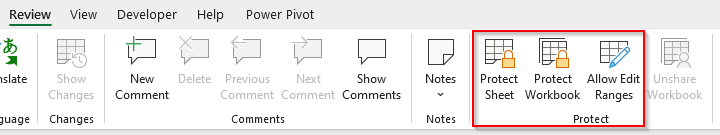
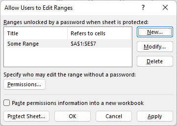
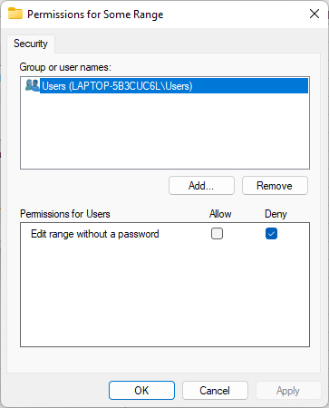
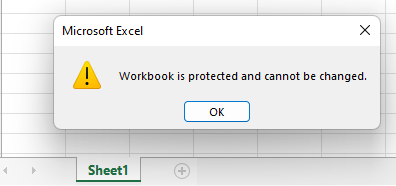
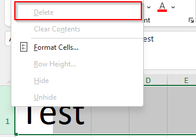

#######################
Modification Protection
#######################

****************
Feature overview
****************

Excel can protect data in a workbook against modification. The feature can be
accessed thourgh *Review* ribbon panel.

  
The protection is only useful against accidental modification, it inserts an
element with calculated hash of protected elements to the workbook. User still
can modify the file directly by unzipping the xlsx file and modifying the xml
files.

Workbook can be protected on several levels:

* Workbook level - user can't add, delete or rename worksheets to the workbook.
* Worksheet level - user can modify worksheet only though limited subset of
  commands. Content of the cells is locked for whole worksheet.
* Range level - Even if worksheet is locked, it is possible to edit cells in
  a specified range, either unlocking the range by a password or by being a
  member of a group.

   
Password is not stored in the xlsx file, there is only a salt and a hash
calculated using an algorithm. User inputted password is combined with the salt
from the file using the algorithm and the result is compared to the stored
file.   

*************
Available API
*************

ClosedXML doesn't respect locked elements. All operations and modifications
are allowed no matter the workbook protection settings.

Each ``Protect`` method has an overload that accepts a password and a hash
algorithm. Use only hash algorithms without a known collision (i.e. no MD5,
CRC32, SHA-1). Note that all available hash algorithms are designed for speed
and password crackers like John the Ripper will likely be able to break
passwords.

.. note::
   API has been designed to accept allowed elements. That leads to rather
   unintuitive code like:
   
   * ``wb.Protect(XLWorkbookProtectionElements.None)`` means "nothing is
     allowed to changes", but code reads like "protect no element"
   * ``wb.Protect(XLWorkbookProtectionElements.Everything)`` means "everything
     is allowed to changes", but code reads like "protect everything"
   
   It is recommended to explicitely write ``allowedElements`` parameter name
   when using the API.

Workbook protection
===================

ClosedXML can protect workbook through structure through 
``IXLWorkbook.Protect(XLWorkbookProtectionElements)``.
The ``XLWorkbookProtectionElements`` enum is a flag enum and it is possible to
combine individual elements using bit-wise operation. It is recommended to
always allow modification of ``XLWorkbookProtectionElements.Windows`` (it is
a default value when parameter is not specified) elements that allows moving,
resizing, or closing the workbook window. The option has been deprecated and
is used only by obsolete versions of Excel, but is is still part of the
standard.

.. code-block:: csharp
   :caption: Code to create workbook that has protected structure.

   var wb = new XLWorkbook();	
   var ws = wb.AddWorksheet();
   wb.Protect("Pa55w0rD", XLProtectionAlgorithm.Algorithm.SHA512, allowedElements: XLWorkbookProtectionElements.Windows);
   
   Assert.IsTrue(wb.IsProtected);
   Assert.IsTrue(wb.IsPasswordProtected);  
   wb.SaveAs("protect-workbook.xlsx");

The locked workbook will display an rrror message when user tries to rename
a sheet and the *+* button to add new sheet will be grayed out indicating that
the workbook structure can't be modified.

Worksheet protection
====================

Worksheet protection locks all cells on the sheet and only allows specified
operations. Once again, note that API defined *allowedElements*, not protected
elements.

.. code-block:: csharp

   var wb = new XLWorkbook();
   var ws = wb.AddWorksheet();
   ws.Cell("A1").Value = "Test";
   ws.Protect("Pa55w0rD", XLProtectionAlgorithm.Algorithm.SHA512,
   		   allowedElements: XLSheetProtectionElements.DeleteRows | XLSheetProtectionElements.SelectEverything | XLSheetProtectionElements.FormatCells);
   // Allowed elements can also be removed from protection
   ws.Protection.DisallowElement(XLSheetProtectionElements.DeleteRows);
   
   Assert.IsTrue(ws.IsProtected);
   Assert.IsTrue(ws.IsPasswordProtected);
   Assert.AreEqual(XLProtectionAlgorithm.Algorithm.SHA512, ws.Protection.Algorithm);
   Assert.IsFalse(ws.Protection.AllowedElements.HasFlag(XLSheetProtectionElements.DeleteRows));
   Assert.IsTrue(ws.Protection.AllowedElements.HasFlag(XLSheetProtectionElements.SelectLockedCells));
   Assert.IsTrue(ws.Protection.AllowedElements.HasFlag(XLSheetProtectionElements.FormatCells));
   wb.SaveAs("protect-worksheet.xlsx");

Excel allows change of a format, but disallowed elements, like delete row are not avialble.

Allow edit ranges
=================

ClosedXML doesn't support this feature yet.

Unprotect worksheet or workbook
===============================

You can use ``IXLWorkbook.Unprotect``/``IXLWorksheet.Unprotect`` methods to
remove protection from a workbook/worksheet. If the protection uses password,
you must supply a valid password, otherwise an ``ArgumentException`` will be
thrown.
