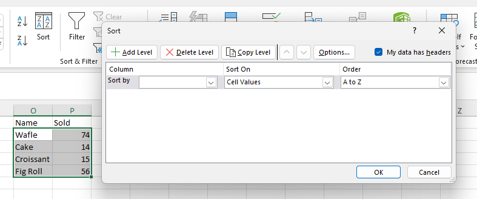
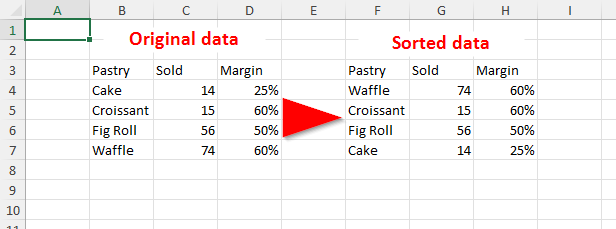
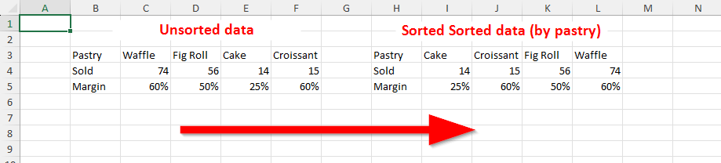

*******
Sorting
*******

It's possible to sort a range in a worksheet.

Sorting algorithm
=================

The values are sorted same way as Excel, first by type, then by value.

* *Logical* - ``false`` is less than ``true``.
* *Number* - numbers are sorted according to their value.
* *Text* - text is sorted by current culture. Note that empty string is generally smallest possible
  text and thus is first element (blank is different from empty string).
* *Error* - individual error values never change relative order during sorting.
* *Blank* - blanks are always last, regardless of sorting order.

  * Ascending order is *number*, *text*, *logical*, *error* and *blank*.
  * Descending order is *error*, *logical*, *text*, *number* and *blank*.

Sorting is stable.

.. note::
   Sorting can only be done on cell values, not cell or font colors.

Sorting methods may contain two flags that modify how are values sorted.

The ``matchCase`` flag
------------------

The flag determines if text values are sorted in a case-sensitive (using current culture) manner:

* ``false`` (default value) - text values are sorted in a case insensitive way, **Hello** is
  treated same as **hello** or **HELLO**.
* ``true`` - text values are treated in a case sensitive way. **hello** is different from
  **HELLO**. Note that whether lower-case letters are sorted before upper-case ones depends on
  the culture.

The ``ignoreBlanks`` flag
---------------------

This flag determines how should blank values be treated during sorting:

* ``true`` (default value) - blanks are always last in any sorting order.
* ``false`` - blanks are treated as empty string and are thus grouped with text values. The empty
  text is (unless culture is insane) always smaller than any other text and is thus sorted
  before/after any other text in ascending/descending order.

.. note::
   The simplest way to enter empty string into an Excel is to write apostrophe (**'**) into a cell
   and press enter. The ``TYPE`` function will then return 2 for the cell, indicating text type.
   The apostrophe is displayed because of a style (``IXLStyle.IncludeQuotePrefix``), it's not
   actual value. To get rid of apostrophe, you can copy value of a cell into another one.

Sorting rows
============

In order to sort rows, select a range to be sorted and call one of the `IXLRange.Sort()` methods.
There are three of them, later two are only more specialized version of first one:

* ``IXLRange.Sort(string columnsToSortBy, XLSortOrder sortOrder, Boolean matchCase = false, Boolean ignoreBlanks = true)``
* ``IXLRange Sort(Int32 columnToSortBy, XLSortOrder sortOrder, Boolean matchCase = false, Boolean ignoreBlanks = true)``
* ``IXLRange.Sort()`` may use ``IXLRange.SortColumns`` property instead of ``columnsToSortBy``
  parameter. The ``IXLRange.SortColumns`` defines sort state of the range. The general idea is to
  set ``IXLRange.SortColumns`` parameters and then call ``IXLRange.Sort()``.

The ``columnsToSortBy`` parameter can be used to select columns and sorting order of them, e.g.
``2 ASC, 3 DESC`` will sort second column of a range in ascending order and then by values of third
column  in descending order.

* Columns are separated by comma (**,**).
* Column can be specified either by number (e.g. **5**) or by column letter (e.g. **E**). Columns
  are specified relative to the range (e.g. **C** for range **B2:E7** means column **D** in
  absolute coordinates).
* Sort order can be **ASC** or **DESC** or nothing. If none is specified for a column, the
  `sortOrder` parameter is used.

Sorting rows example
--------------------

.. code-block:: csharp

   using var wb = new XLWorkbook();
   var ws = wb.AddWorksheet();
   ws.Column("D").Style.NumberFormat.SetNumberFormatId((int)XLPredefinedFormat.Number.PercentInteger);
   var range = ws.Cell("B3").InsertData(new[]
   {
       new object[]{ "Pastry",    "Sold", "Margin" },
       new object[]{ "Cake",      14,     0.25 },
       new object[]{ "Croissant", 15,     0.60 },
       new object[]{ "Fig Roll",  56,     0.50 },
       new object[]{ "Waffle",    74,     0.60 },
   });
   range.CopyTo(ws.Cell("F3"));
   var dataRangeOfCopy = ws.Range("F4:H7");
   
   dataRangeOfCopy.Sort("3 DESC, 2 DESC");
   wb.SaveAs("sort-rows-example.xlsx");

Sorting columns
===============

Sometimes data we want to sort is stored is columns, not rows. The method to use is
``IXLRange.SortLeftToRight``. It's significantly more limited than row sorting, it can't set
columns to sort by, nor their order. The sorting uses data from first row, then second, then third
and so on. It's mostly useful for rows (each row is of course range).

Sorting columns example
-----------------------

.. code-block:: csharp

   using var wb = new XLWorkbook();
   var ws = wb.AddWorksheet();
   ws.Row(5).Style.NumberFormat.SetNumberFormatId((int)XLPredefinedFormat.Number.PercentInteger);
   var range = ws.Cell("B3").InsertData(new[]
   {
       new object[]{ "Pastry", "Waffle", "Fig Roll", "Cake", "Croissant", },
       new object[]{ "Sold",         74,         56,     14,          15, },
       new object[]{ "Margin",     0.60,       0.50,   0.25,        0.60, },
   });
   range.CopyTo(ws.Cell("H3"));
   var dataRangeOfCopy = ws.Range("I3:L5");

   dataRangeOfCopy.SortRows.Add(3, XLSortOrder.Descending);
   dataRangeOfCopy.SortRows.Add(2, XLSortOrder.Descending);
   dataRangeOfCopy.SortLeftToRight();
   wb.SaveAs("sort-cols-example.xlsx");

