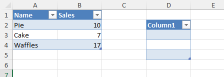

******
Tables
******

Excel can create a table from a range in a worksheet.

Table creation
==============

Table can be created during data insertion or from existing data.

* `IXLCell.InsertTable` - create table when data is being inserted.
* `IXLRange.CreateTable` - create table from existing data.

.. code-block:: csharp
   :caption: Sample to create a tables

   using ClosedXML.Excel;

   using var wb = new XLWorkbook();
   var ws = wb.AddWorksheet();
   ws.ColumnWidth = 12;
   ws.FirstCell().InsertTable(new[]
   {
       new Pastry("Pie", 10),
       new Pastry("Cake", 7),
       new Pastry("Waffles", 17)
   }, "PastrySales", true);

   ws.Range("D2:D5").CreateTable("Table");

   wb.SaveAs("tables-create.xlsx");

   record Pastry(string Name, int Sales);

Since each column represents a field and each field must have a non-empty
unique name in the table, the table creation methods will autogenerate
a name for columns that are empty.

Table resizing
==============

Table can be resized. If any header cell of a new range is empty, it will be
filled with a auto-generated column name.

.. code-block:: csharp
   :caption: Sample to resize a table

   using ClosedXML.Excel;

   using var wb = new XLWorkbook();
   var ws = wb.AddWorksheet();

   ws.Cell(1, 1).Value = "Foo";
   ws.Cell(1, 2).Value = "Bar";
   ws.Range("A2:B5").Value = 10;
   var table = ws.Range("A1:B5").CreateTable();

   table.Resize("B1", "D3");

   wb.SaveAs("tables-resize.xlsx");

Table theme
===========

Every table has a theme. A newly created table has a *None* theme. Table theme
can be changed through `IXLTable.Theme` property to a member of `XLThemeTable`
class. In order to map the `XLThemeTable` member to an Excel theme, use a tooltip that
is displayed over the theme in the Excel.

.. code-block:: csharp
   :caption: Sample showing the table structure modification.

   using ClosedXML.Excel;

   using var wb = new XLWorkbook();
   var ws = wb.AddWorksheet();

   ws.Cell("A1").SetValue("First");
   ws.Cell("A2").InsertData(Enumerable.Range(1, 5));
   ws.Cell("B1").SetValue("Second");
   ws.Cell("B2").InsertData(Enumerable.Range(1, 5));

   var table = ws.Range("A1:B6").CreateTable();
   table.Theme = XLTableTheme.TableStyleLight16;

   table = table.CopyTo(ws.Cell("D1")).CreateTable();
   table.Theme = XLTableTheme.TableStyleDark2;

   table = table.CopyTo(ws.Cell("G1")).CreateTable();
   table.Theme = XLTableTheme.TableStyleMedium15;

   wb.SaveAs("tables-themes.xlsx");

Table style options
===================

Table has a style that can affect how it is displayed in a worksheet.
`IXLTable` contains several properties that can modify how is the table
displayed.

.. code-block:: csharp
   :caption: Sample showing the table structure modification.

   using ClosedXML.Excel;

   using var wb = new XLWorkbook();
   var ws = wb.AddWorksheet();

   ws.Cell("A1").SetValue("First");
   ws.Cell("A2").InsertData(Enumerable.Range(1, 5));
   ws.Cell("B1").SetValue("Second");
   ws.Cell("B2").InsertData(Enumerable.Range(1, 5));

   var table = ws.Range("A1:B6").CreateTable();
   table.CopyTo(ws.Cell("D1")).CreateTable();

   table
       .SetShowHeaderRow(false)
       .SetShowRowStripes(false)
       .SetShowColumnStripes(true)
       .SetShowAutoFilter(true)
       .SetShowTotalsRow(true);

   // Totals can be set only if the totals row is displayed
   table.Field("First").TotalsRowFunction = XLTotalsRowFunction.Sum;
   table.Field("Second").TotalsRowFunction = XLTotalsRowFunction.Average;

   wb.SaveAs("tables-structure.xlsx");

The sample sets the style options only for one table and has a second table
one for comparison.

Table name
==========

Table has a name. Name of the table must be unique across a worksheet. The table name
can be used in formulas through structured references, e.g. `=SUM(PastryTable[Sales])`
instead of referencing column cells directly.

.. code-block:: csharp
   :caption: How to use table name in structural reference.

   using ClosedXML.Excel;

   using var wb = new XLWorkbook();
   var ws = wb.AddWorksheet();
   ws.FirstCell().InsertTable(new[]
   {
       new Pastry("Pie", 10),
       new Pastry("Cake", 7),
       new Pastry("Waffles", 17)
   }, "PastrySales", true);

   ws.Cell("D2").Value = "Total pastry sales:";
   ws.Cell("D3").FormulaA1 = "SUM(PastrySales[Sales])";

   wb.SaveAs("tables-formula-reference.xlsx");

   record Pastry(string Name, int Sales);

You can change table name through `IXLTable.Name` property.

.. warning::
   Evaluation of structured references is not yet supported.

Header & Fields
===============

Table can display a header row. Header row displays names of the table
fields. Table field consists of data cells in a single column of the table.
Whether the header row is displayed or not is determined by the
`IXLTable.ShowHeaderRow` property.

ClosedXML table creation methods will use first values to deterine field names
and will always display header by default (though it can be hidden).

Field names must be of type `string`. Field name can be changed either through
`IXLTableField.Name` property or by setting a cell value, provided header column
is shown. Cell value is converted to string though.

Individual table fields can be accessed through `IXLTable.Field(string name)` method
or by `IXLTable.Fields` collection. There isn't an indexer.

Header row is not the source of truth for field name, the field name is only
projected to the header row cells. Fields have names, whether table has header
row or not, as demonstrated by the sample.

.. code-block:: csharp

   using ClosedXML.Excel;

   using var wb = new XLWorkbook();
   var ws = wb.AddWorksheet();

   ws.Cell("A1").SetValue("Original Name");
   ws.Cell("A2").InsertData(Enumerable.Range(1, 5));

   var table = ws.Range("A1:A6").CreateTable("Table");
   table.ShowHeaderRow = false;
   ws.Cell("A1").Value = "Changed Name";

   // Reference original name of the field, although the actual value
   // in the cell where header used to be is changed.
   ws.Cell("D2").FormulaA1 = "SUM(Table[Original Name])";

   wb.SaveAs("tables-header.xlsx");

Totals
======

Table can display a totals row. Totals row usually contains formulas that
summarize the field values. Whether the totals row is displayed or not is
determined by the `IXLTable.ShowTotalsRow` property.

Methods that modify totals row will throw an exception if the table doesn't
show totals row.

.. code-block:: csharp

   using ClosedXML.Excel;

   using var wb = new XLWorkbook();
   var ws = wb.AddWorksheet();

   var table = ws.Cell("A1").InsertTable(new[]
   {
       new Pastry("Cake", 39, 3),
       new Pastry("Waffles", 15, 12),
       new Pastry("Pie", 19, 27)
   });

   table.ShowTotalsRow = true;
   table.Field(nameof(Pastry.Name)).TotalsRowLabel = "Avg.";
   table.Field(nameof(Pastry.UnitPrice)).TotalsRowFunction = XLTotalsRowFunction.Average;
   table.Field(nameof(Pastry.Sold)).TotalsRowFunction = XLTotalsRowFunction.Average;

   wb.SaveAs("tables-totals.xlsx");

   record Pastry(string Name, double UnitPrice, int Sold);

It's also possible to use a custom formula through `IXLTableField.TotalsRowFormulaA1`
property. Formula should reference table fields through structured
references to ensure correctness even after table resizing.

Auto Filter
===========

Table can be filtered and sorted through auto filter feature. For more details, see
autofilter documentation.

.. code-block:: csharp

   using ClosedXML.Excel;

   using var wb = new XLWorkbook();
   var ws = wb.AddWorksheet();

   var table = ws.Cell("B3").InsertTable(new[]
   {
       new Pastry("Cake", 39, 3),
       new Pastry("Waffles", 15, 12),
       new Pastry("Pie", 19, 27)
   });

   table.ShowAutoFilter = true;

   // Must enable the filter
   table.AutoFilter.IsEnabled = true;

   // Sort by first column, desc
   table.AutoFilter.Sort(1, XLSortOrder.Descending);

   // Only pastries that sold more than 10 pieces (through column number in the table)
   table.AutoFilter.Column(3).GreaterThan(10);

   wb.SaveAs("tables-autofilter.xlsx");

   record Pastry(string Name, double UnitPrice, int Sold);

