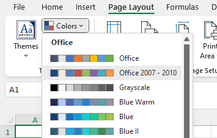
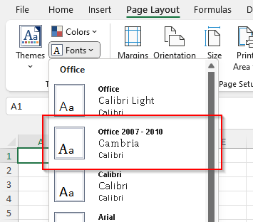
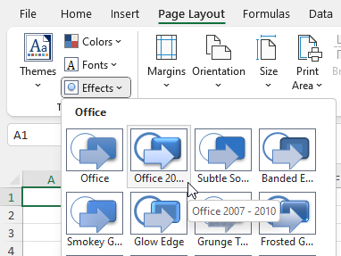
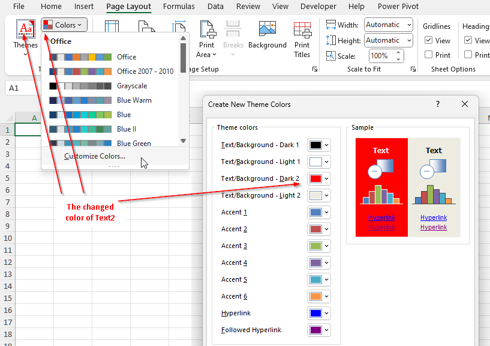
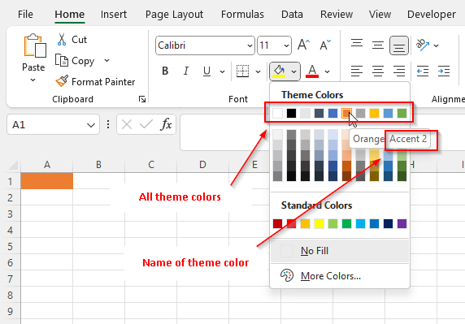
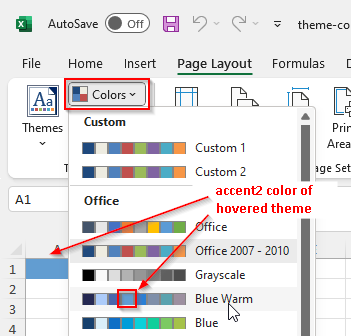
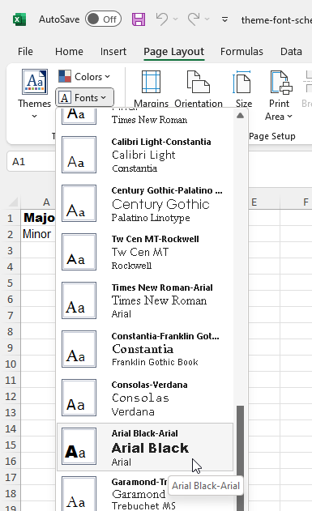

*****
Theme
*****

A "theme" refers to a collection of predefined design elements that can be
applied to a workbook, worksheet, chart, or any other element within Excel.
Themes include a combination of *colors*, *fonts*, and *effects* that provide
a consistent look of the workbooks.

By using themes, you can quickly change the overall look of workbook without
needing to individually format each component. 

Workbook theme
==============

A theme of a workbook is represented by the ``IXLTheme`` interface. It can be
accessed through ``IXLWorkbook.Theme`` property.

The theme consists of three parts:

* Color scheme - colors that can be used in a workbook.
* Font scheme - two fonts that can be used in a workbook.
* Effects - how should various objects look like, mostly shapes.

A new created workbook has its theme set to the **Office 2007-2010**.

Each theme part can be modified independently of others. In order to modify the
theme, change the properties of the ``IXLTheme``.

.. code-block:: csharp
   :caption: Modify the theme color for a workbook.

   using var wb = new XLWorkbook();
   var ws = wb.AddWorksheet();
   var red = XLColor.FromHtml("FF0000");
   wb.Theme.Text2 = red;
   wb.SaveAs("theme-modified.xlsx");

.. warning::
   Only theme colors are loaded/saved from/to a workbook.
   
   As of 0.103, there is no capability to load font scheme or effects. The font
   scheme and effects saved to the file are always **Office 2007-2010**.

.. note::
   Themes displayed in Excel are version dependent, Microsoft might add or
   remove themes across versions.
   
   The Excel will highlight/select the theme in GUI depending on the values of
   the theme (e.g. color values from the color scheme), not the theme name.
   
   If the values of a part in a workbook don't match any Excel predefined values,
   no predefined item is highlighted.

Colors scheme
=============

The theme color can be created from static method
``XLColor.FromTheme(XLThemeColor)``. The theme color is a symbolic name and
doesn't contain actual color value. The color can be used by any API that
accepts ``XLColor``, e.g. cell fill, font color, sparkline and others.

.. code-block:: csharp
   :caption: Create a workbook with theme color

   using var wb = new XLWorkbook();
   var ws = wb.AddWorksheet();
   var accent2ThemeColor = XLColor.FromTheme(XLThemeColor.Accent2);
   ws.Cell("A1").Style.Fill.BackgroundColor = accent2ThemeColor;
   wb.SaveAs("theme-color-picker-font-color.xlsx");

The actual displayed color is determined by a theme and when theme colors change,
so does the fill color.

.. note::
   In order to get actual RGB value of a theme color, either use
   ``XLWorkbook.Theme.ResolveThemeColor(XLThemeColor)`` or one of ``IXLTheme``
   properties (e.g. ``XLWorkbook.Theme.Accent2``).
   
   The ``XLColor.Color`` throws an exception, because ``XLColor`` is a value
   object independent of a workbook and  thus has no way to resolve the color
   by itself and other potential problems (e.g. use color from one workbook
   in a different workbook).

Font scheme
===========

Theme contains two font specifications, called *major* and *minor* font scheme.
To assign one of the font schemes to a text, set the the font property
``IXLFontBase.FontScheme`` to one of the schemes.

The font scheme can be set to any text through its font property. The font of
such text is updated, when a font scheme is changed in a theme.

.. code-block:: csharp
   :caption: Create a workbook with font in a scheme

   using var wb = new XLWorkbook();
   var ws = wb.AddWorksheet();
   
   ws.Cell("A1")
       .SetValue("Major")
       .Style.Font.SetFontScheme(XLFontScheme.Major);
   ws.Cell("A1")
       .SetValue("Minor")
       .Style.Font.SetFontScheme(XLFontScheme.Minor);
   wb.SaveAs("theme-font-scheme.xlsx");

Effects
=======

.. warning::
   Effects are not implemented.
