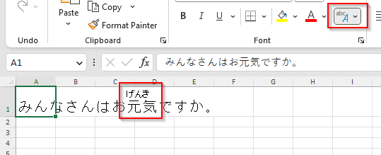
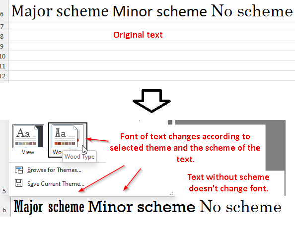

#######################
Release notes for 0.101
#######################

*************
Show phonetic
*************

A toggle to display or hide phonetic information (basically only furigana for
Japanese) for cells is now available through ``IXLCell.ShowPhonetic`` property.

***********
Font scheme
***********

Rich text can now be associated with a font scheme. Excel updates font of a text
associated with a scheme when theme changes.

*************
Text rotation
*************

Text rotation of a text (`IXLAlignment.TextRotation`) in a cell can now be only
-90 to 90 degrees or a special value 255 representing vertical layout of
the text.

Originally, the text rotation could be -90 to 180, but negative values didn't
rotate text properly and values 91-180 were interpreted as negative
degrees.
