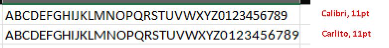
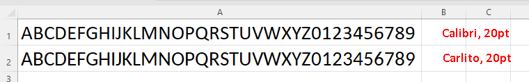

############
Missing font
############

This page should help resolve the exception about a missing font:

  Unable to find font *font name* or fallback font *fallback font name*.
  Install missing fonts or specify a different fallback font through
  'LoadOptions.DefaultGraphicEngine = new DefaultGraphicEngine("Fallback font name")'.

The exception was most likely thrown during a call of ``IXLColumn.AdjustToContent``
on Linux or some Cloud service that doesn't contain Windows fonts (e.g. AWS
lambda functions, Azure functions).

.. note::
   For more details about how the engine works and available API,
   see `graphic engine </en/latest/features/graphic-engine.html>`_ page.

**************************
Explanation of the problem
**************************

Graphic engine is responsible for extracting information about images and
measuring size of a text in a workbook. The exception indicates that
ClosedXML (more precisely *SixLabors.Fonts* that is used by the default
engine) wasn't enable to find a font that could be used to measure size
of a text.

Calculating a correct size of a text rendered by a font is a nontrivial task
and there is a dearth of maintained open source .NET font libraries. That is
why ClosedXML depends on prerelease version of *SixLabors.Fonts*.

``DefaultGraphicEngine`` tries to use a requested font (e.g. font of a cell)
and if the requested font isn't present on the machine, it will use fallback
font (*Microsoft Sans Serif*). If not even fallback font is found, it throws
the aforementioned exception.

.. note::
   It is  responsibility of developer to ensure that required font/s are
   present. ClosedXML needs font metrics and substitution tables to calculate
   text bounds in the font. It can't pull them out of thin air.

SixLabors.Fonts library looks for fonts in the following folders
(`source <https://github.com/SixLabors/Fonts/blob/main/src/SixLabors.Fonts/SystemFontCollection.cs#L38>`_):

* Windows

  * ``%SYSTEMROOT%\Fonts``
  * ``%APPDATA%\Microsoft\Windows\Fonts``
  * ``%LOCALAPPDATA%\Microsoft\Windows\Fonts``

* Linux

  * ``%HOME%/.fonts/``
  * ``/usr/local/share/fonts/``
  * ``/usr/share/fonts/``

* OSX

  * ``%HOME%/Library/Fonts/``
  * ``/Library/Fonts/``
  * ``/System/Library/Fonts/``
  * ``/Network/Library/Fonts/``

* Android

  * ``/system/fonts/``

.. note::
   The default font for a xlsx is a Calibri font. That are two problems
   with Calibri:

   * Calibri is a copyrighted font - it can't be bundled, converted and has
     a plethora of restrictions.
   * Calibri isn't present on non-windows machines.

   The consequence is that files that used created on non-windows likely won't
   have accurately calculated text width due to incorrect font metrics of
   the fallback font.

*********
Solutions
*********

You can either

* Install font on the environment
* Bundle a font with the application (only for version 0.100+)
* Use a wrapper.

Use already installed font
==========================

If you don't care much about accuracy, pick already installed font and instruct
ClosedXML to use that one as a fallback font. That is basically the advice from
the exception message.

First, get a list of fonts that are available on the target environment

.. code-block:: csharp

   foreach (var fontFamily in SixLabors.Fonts.SystemFonts.Collection.Families)
      Console.WriteLine(fontFamily.Name);

Pick already installed font that looks similar to Calibri (probably slightly
wider to avoid clipping or #### signs). In the setup part of your application,
choose a font that will be used as a fallback font.

.. code-block:: csharp

   // "Fallback font name" will likely be something like "DejaVu Sans" or "Tahoma"
   // It is not a path to font file, but a font name.
   LoadOptions.DefaultGraphicEngine = new DefaultGraphicEngine("Fallback font name");

Use a font similar to Calibri (likely Carlito)
==============================================

Find a font that looks similar to Calibri. Similarity means character widths
and heights, not the shape of letters.

The most likely candidate is a `Carlito font <https://fontlibrary.org/en/font/carlito>`_:

  Carlito (Google’s Carlito font, google-crosextrafonts-carlito) is a modern,
  friendly sans-serif font, metric-compatible with Microsoft Fonts Calibri
  font. Carlito comes in regular, bold, italic, and bold italic. The family
  covers Latin-Greek-Cyrillic (not a complete set, though) with about 2,000
  glyphs. It has the same character coverage as Microsoft Fonts Calibri. This
  font is sans-serif typeface family based on Lato. Carlito is a default
  Calibri font replace in the LibreOffice Suite.

The key part is *metric-compatible with Microsoft Fonts Calibri*. Note that
the claim is only valid for larger sizes, Calibri has a bitpoint maps that
are used at smaller sizes (up to 19 pts). It is not exactly the same, but close
enough and the important thing is that Carlito metrics is slighly wider (letter
M, numbers) than Calibri bitmap sizes. Thanks to that, the text in cells won't
be clipped or displayed as `####`).

Install the selected font on the target environment or bundle the font with
the application.

.. code-block:: csharp
   :caption: Code to use Carlito as a default font

   using (var fallbackFontStream = Assembly.GetExecutingAssembly().GetManifestResourceStream("Carlito.ttf"))
   {
       // Carlito font will be used for everything, since it is the fallback font and no other font was loaded
       LoadOptions.DefaultGraphicEngine = DefaultGraphicEngine.CreateOnlyWithFonts(fallbackFontStream);
   }

Install Windows fonts
=====================

Install Calibri/Microsofot Sans Serif font to the target environment.

* Upside

  * ClosedXML will use correct font metrics

* Downside

  * Requires a license.
  * In some cases, it is not possible to install fonts (e.g. Azure Functions)
  * Font must be present on all target environments

Bundle font (version 0.100+)
============================

Bundle a font with the application (either as an embedded resource or in an installation
directory) and create ``DefaultGraphicEngine`` with a stream of bundled font.

.. code-block:: csharp

   using (var fallbackFontStream = Assembly.GetExecutingAssembly().GetManifestResourceStream("Namespace.SomeFont.ttf"))
   {
       LoadOptions.DefaultGraphicEngine = DefaultGraphicEngine.CreateWithFontsAndSystemFonts(fallbackFontStream);
   }

The ``DefaultGraphicEngine`` constructor can accept multiple font streams, so
it is possible to load fonts that are actually used in the workbooks, not just
fallback font. That is rather useful for client-side Blazor.

Set ``IXLColumn.Width``/``IXLColumn.Height``
============================================

Width of columns and height of row can be set explicitely. Row has its height
expressed in points, width of column is expressed in multiples of Maximum Digit
Width (MDW). MDW is a maximum width of a any digit (0-9) in pixels. If column
has width 12.5, it means 12.5 * width_of_widest_0-9_digit.

For more information about how does Excel calculate width of a cell during
``AdjustToContent``, see `Cell Dimension Dev documentation <https://github.com/ClosedXML/ClosedXML/wiki/Cell-Dimensions>`_.

Create adapter
==============

Not recommended, but you can create a new implementation of
``IXLGraphicEngine``, delegate ``IXLGraphicEngine.GetPictureInfo`` to
``DefaultGraphicEngine.Instance.Value.GetPictureInfo`` and implement font
measurement methods using only the EM square size (IXLFontBase.FontSize is
always passed as a parameter) or some hard coded values.
